# CSE

# System

Example: Web, Web Server, Android, Ext-4 file system, ...

## Problem: Complexity

### Description

- Programming / Data Structure
    - LoC(Lines of Code): From hundreds to millions
- Operating System / Architecture
    - CPU cores: From one to hundreds
- Network
    - Nodes: From two to millions
- Web Service
    - Clients: From tens to millions


### Problem Types

- Emergent properties(surprise)
    - 在设计时并未被考虑到，当实际投入使用才发现的问题
- Propagation of effects
    - Small change => Big effect
- Incommensurate scaling
    - 对于小型系统的设计可能不能够做到很好的 scaling
- Trade-offs
    - 水床效应 （此消彼长）

#### Emergent Properties

- Features
    - 该系统独立运行时毫无问题
    - 一旦与其他系统交互就产生问题
    - Surprise
    - 不可改变的事实：只有在系统被完整的搭建完后才能发现的bug

- Example
    - 最初的点对点网络传输：
        - 所有电脑共享一根网线
        - 可靠的传输
        - 如果两个节点同时向对方发送消息，那么两个节点都会取消发送，并等待随机时间
        - A必须先发送一个f(v)大小包头，成功发送，以确认网线可用（v是网络传输速率）
        - 随着网速变快，这种方式所需要发送的包头越来越大

#### Propagation of Effects

略

#### Incommensurate Scaling

随着系统不断变的庞大，里面的设计可能就不能够很好的支持越来越大的系统正常运行

- Example
    - Internet
        - Size routing tables（for shortest paths） 时间复杂度 O(n^2)
            - Hierarchical routing on network numbers
            - Address: 16-bit network number and 16-bit host number
        - Limited networks(2^16)
        - 以上这种方式随着网络越来越庞大就不是那么好用了
        - 解决方案：
            - NAT(Network Address Translator) 对应 Size routing tables
            - IPv6 对应 IPv4

#### Trade-offs


- General Models 大多数模型要考虑的如下
    - Limited amount of goodness
    - Maximize the goodness
    - Avoid wasting
    - Allocate where helps most
- Waterbed Effect 但是会碰到水床效应
    - Pushing down on a problem at one point 使某个问题得到优化
    - Causes another problem to pop up somewhere else 但同时使另一个点更加糟糕
- Binary Classification
    -  我们希望能够将很多性能指标分为两个类别
        - Based on presence or absence of some property
    - 但是我们缺少一个能够直接衡量这些指标的方式
    - 所以我们往往通过一些间接的方式
        - Known as proxy
    - 往往这会少考虑一些东西
    - 通过调整 proxy 的参数，它应该可以
        - 减少一类的错误
        - 但是同时会提升另外一些错误


## How to handle? Limit the Levels of Complexity

- Modularity
    - Split up system
    - Consider separately
- Abstraction
    - Interface / Hiding
    - Avoid propagation of effects
- Layering
    - Gradually build up capabilities
- Hierarchy
    - Reduce connections
    - Divide-and-conquer 分治

### Modularity

- 分析并将系统设计为互相交互的多个子系统
    - Subsystems called modules
    - Divide-and-conquer technique
- 模块化是最简单有效且最重要的方式来减少复杂度
    - 只需要考虑模块内部的交互，而不需要考虑其他模块内的部分

- Example
    - Monolithic System
        - BugCount ~ `N`
        - DebugTime ~ `N * BugCount` ~ `N^2`
    - Modularized System
        - BugCount ~ `N`
        - Amount of Module ~ `K`
        - DebugTime ~ `(N/K)^2 * K` ~ `N^2 / K`

### Abstraction

- Abstraction
    - Treat a module based on external specifications, no need for details inside
- Principles to divide a module
    - Follow natural of effective boundaries
    - Fewer interactions among modules
    - Less propagation of effects
- Problem: minimizing interconnections among modules may be defeated
    - Unintentional or accidental interconnections, arising from implementation errors
    - Well-meaning design attempts to sneak past modular boundaries
        - Improve performance
        - Meet some other requirement
- Software is particularly subject to this problem
    - The modular boundaries provided by the separately compiled subprograms are actually somewhat soft
    - Is easily penetrated by errors in:
        - using pointer
        - filling buffer
        - calculating array index
        - etc.
- Failure containment
    - When a module does not meet its abstract interface specification
    - Limiting the impact of faults
        - Well-designed and properly enforced modular abstractions
        - Control propagation of effects
    - Modules are the units of fault containment

### Layering

- Goal: Reduce module interconnections even more
- How to do it?
    - Build a set of mechanisms first(a lower layer)
    - Use them to create a different complete set of mechanisms(an upper layer)
- General rule: A module in one layer only interacts with:
    - its peers in the same layer, and
    - modules in the next lower layer / next higher layer

- Example
    - Computer System
        - Application Layer
        - OS Layer
        - Processor & Memory Layer
        - Memory cells & Gates Layer

### Hierarchy

- Hierarchy: another module organization
    - Start with a small group of modules
    - Assemble them into a stable, self-contained subsystem with well defined interface
    - Assemble a group of subsystems to a larger subsystem
- Example
    - 1 manager leads N employees
    - 1 higher manager leads N lower managers
- Constrains interactions
    - Permit interaction only among the components of subsystem 仅仅允许每个模块内部的 Components 相互通信
    - Reduces the number of potential interactions among modules from square-law to linear 减少模块间可能的交互


## Computer Systems are Different
- 计算机系统与其他系统类似
    - 所有复杂系统中会出现一些普遍的问题
    - 会有一些通用的技术来处理这些复杂度
- 但是计算机系统又有不同的地方
    - 复杂度并不受物理定律的限制
    - 技术的更新速度是空前的

### Unbounded Composition 无限的构成
- Two properties of computer systems
    - 1. Mostly digital
    - 2. Controlled by software
    - 两者都使得计算机系统复杂度不受物理定律的限制

### M.A.L.H are NOT enough
- Hard to choose <b>the right</b> modularity
- Hard to choose <b>the right</b> abstraction
- Hard to choose <b>the right</b> layer
- Hard to choose <b>the right</b> hierarchy

### Class Plan
- File System: Abstraction and Layering
- Enforced Modularity: Client & Server, virtualization
- Performance: Systematic way for optimization
- Network: Different layers, resource management
- Fault Tolerance: Replication, logging
- Transaction: Atomicity, isolation, consistency, availability
- Security: threat model, authentication, attacking

# iNode-based File System

## File

- A file has two key properties
    - It is <b>durable</b> and has a <b>name</b>
    - It is a high-level version of the memory abstraction
- System layer implements files using modules from hardware layer
    - Divide-and-conquer strategy
    - Makes use of several hidden layers of machine-oriented names(addresses), one on another, to implement files
    - Maps user-friendly names to these files


## Abstraction: API of UNIX File System
- OPEN, READ, WRITE, SEEK, CLOSE
- FSYNC
- STAT, CHMOD, CHOWN
- RENAME, LINK, UNLINK, SYMLINK
- MKDIR, CHDIR, CHROOT
- MOUNT, UNMOUNT
- ...


## 7 Software Layers
| Layer                    | Purpose                                             | No |
|--------------------------|-----------------------------------------------------|----|
| Symbolic link layer      | Integrate multiple file systems with symbolic links | 7  |
| Absolute path name layer | Provide a rot for the naming hierarchies            | 6  |
| Path name layer          | Organize files into naming hierarchies              | 5  |
| File name layer          | Provide human-oriented names for files              | 4  |
| Inode number layer       | Provide machine-oriented names for files            | 3  |
| File layer               | Organize blocks into files                          | 2  |
| Block layer              | Identify disk blocks                                | 1  |

- The layers from No. 7 - 5 are user-oriented names
- The layer No. 4 is machine-user interface
- The layer from No. 3 - 1 are machine-oriented names

### L1: Block Layer

- Mapping: block number -> block data

```
procedure BLOCK_NUMBER_TO_BLOCK (integer b) returns bock
    return device[b]
```
- Question
    - How to know the size of block
    - How to know which block is free
- Answer:
    - These metadata will alse be stored on the same disk
        - <b>Super block</b> !

- Super Block 
    - One superblock per file system
        - Kernel reads superblock when mount the FS
    - Superblock contains
        - Size of the blocks
        - Size of the inode list
        - Number of free blocks
        - Number of free inodes
        - A list of free blocks
        - A list of free inodes
        - Index to next free block 
        - Index to next free inode
        - Lock field for free block and free inode lists
        - Flag to indicate modification of superblock
        - ...

- Block size: a trade-off
    - Neither too small or too big
    - <b>Q:What will happen if the block size is too small? What if too big?</b>
        - Block size 太小，一个一个Block去找，速度会很慢
        - Block size 太大，很小的文件占很大的 Block， 会很浪费空间

### L2: File Layer

- File requirements
    - Store items that are larger than one block
    - May grow or shrink overtime
    - A file is a linear array of bytes of arbitrary length
    - Record which blocks belong to each file
- Inode(index node)
    - A container for metadata about the file

```
structure inode
    integer block_numbers[N]
    integer size
```

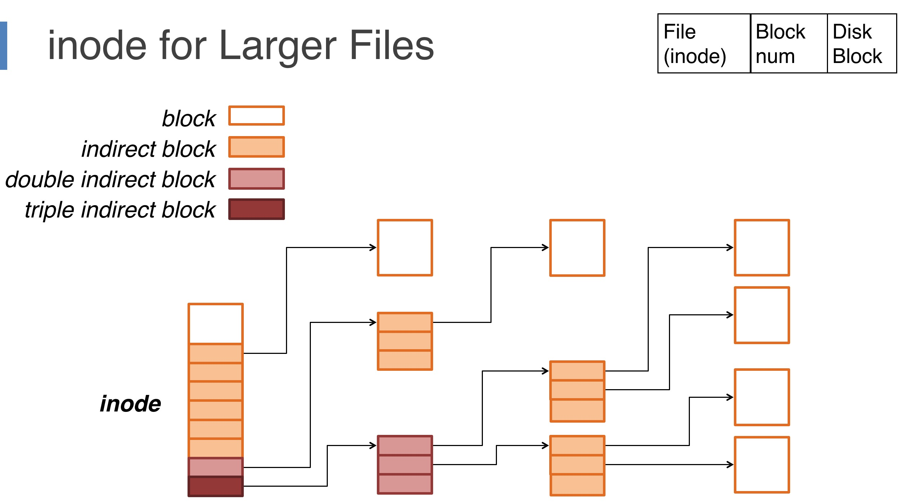

- Given an inode, it can map a <b>block index number</b> (of a file) => <b>block number</b> (of a disk)
    - Index number: e.g. the 3rd block of a file is number 78

```
procedure INODE_TO_BLOCK(integer offset, inode instance i) returns block
    o <- offset / BLOCKSIZE
    b <- INDEX_TO_BLOCK_NUMBER(i, o)
    return BLOCK_NUMBER_TO_BLOCK(b)

procedure INDEX_TO_BLOCK_NUMBER(inode instance i, integer index) returns integer
    return i.block_numbers[index]
```

offset 是要访问的位置。比如Block size 30，要访问的位置200，那么 block index 就是 200/30 = 6，即该位置位于这个文件的第6个 Block 中

### L3: inode Number Layer
- Mapping: <b>inode number</b> => <b>inode</b>

```
procedure INODE_NUMBER_TO_INODE(integer inode_number) returns inode
    retrn inode_table[inode_number]
```

- inode table: at a fixed location on storage
    - inode number is the index of inode table
    - Track which inode number are in use, e.g. free list, a field in inode

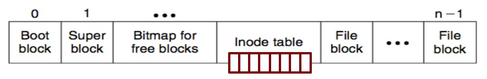

### Put L1 - L3 Layers Together

- 使用 inode number 足够来操作文件
- inode number 还是看着很难受，需要更加 user-friendly 的表示方法
    - 数字只对计算机友好
- Numbers change on different storage device  每台设备上 inode number 都会改变

### L4: File Name Layer

- File name
    - Hide metadata of file management
    - Files and I/O devices
- Mapping
    - Mapping table is saved in directory
    - Default context: current working directory
        - Context reference is also inode number
        - The inode number of current directory is also a file
        - Max length of a file name is 14 bytes in UNIX version 6
```
structure inode
    integer block_numbers[N]
    integer size
    integer type

procedure NAME_TO_INODE_NUMBER(character string filename, integer dir) returns integer
    return LOOKUP(filename, dir)
```

The following table is what a directory looks like.

| File name | inode number |
|-----------|--------------|
| program   | 10           |
| paper     | 12           |

```
procedure LOOKUP (character string filename, integer dir) returns integer
    block instance b
    inode instance i <- INODE_NUMBER_TO_INODE(dir)
    if (i.type != DIRECTORY) then return FAILURE
    for offset from 0 to i.size - 1 do
        b <- INODE_NUMBER_TO_BLOCK(offset, dir)
        if STRING_MATCH(filename, b) then
            return INODE_NUMBER(filename, b)
        offset <- offset + BLOCKSIZE
    return FAILURE
```

- Example
    - Suppose the current working directory is `dir`
    - LOOKUP("program", dir) will return 10
    - Next Problem: <b>What if too many files?</b>

### L5: Path Name Layer
- Hierachy of directories and files
    - Structured naming: E.g. "projects/paper"
    - PLAIN_NAME() returns true if no '/' in the path
- Context: the working directory

```
procedure PATH_TO_INODE_NUMBER(character string path, integer dir)returns integer
    if PLAIN_NAME(path) return NAME_TO_INODE_NUMBER(path, dir)
    else
        dir <- LOOKUP(FIRST(path), dir)
        path <- REST(path)
        return PATH_TO_INODE_NUMBER(path, dir)
```

### Links
- LINK: shortcut for long names
    - LINK("Mail/inbox/new-assignment", "assignment")
    - Turns strict hierarchy into a directed graph
        - Users cannot create links to directories -> acyclic graph
    - Different names, same inode nubmer
- UNLINK
    - Remove the binding of filename to inode number
    - If UNLINK last bingding, put inode/blocks to free-list
        - A reference counter is needed
- Reference Count
    - An inode can bind multiple file names
    - +1 when LINK, -1 when UNLINK
    - A file will be deleted when reference count is 0
    - No cycle allowed
        - Except for '.' and '..'
            - '.' & '..' 是成环的
        - Naming current and parent directory with no need to know their names
```
structure inode
    integer block_number[N]
    integer size
    integer type
    integer refcnt
```

- Example
    - the consequence of cycling
    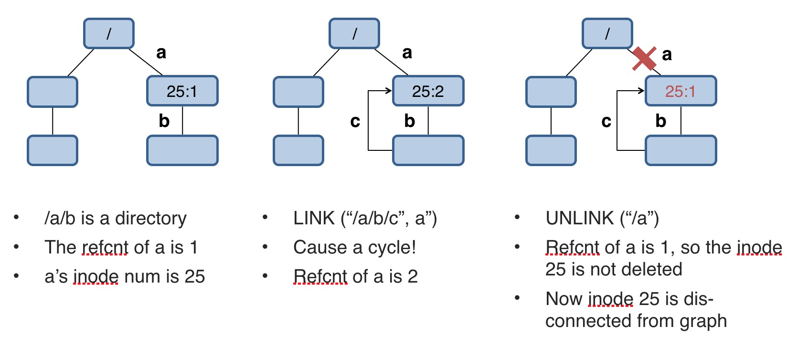

### Renaming - 1

```
1 UNLINK(to_name)
2 LINK(from_name, to_name)
3 UNLINK(from_name)
```
- Text edit usually save editing file in a tmp file
    - Edit in .a.txt.swp, then rename .a.txt.swp to a.txt
- What if the computer fails between 1 & 2 ?
    - to_name will be lost, which surprises the user
    - Need atomic action

### Renaming - 2
```
1 LINK(from_name, to_name)
2 UNLINK(from_name)
```
- Weaker specification without atomic actions
    - 1. Change the inode number in for to_name to the inode number of from_name
    - 2. Removes the directory entry for from_name
- If fails between 1 & 2
    - Must increase reference count of from_name's inode on recovery
- If to_name already exist
    - It will always exist even if machine fails between 1 & 2

### L6: Absolute Path Name Layer
- HOME directory
    - Every user's default working directory
    - Problem: no sharing of HOME files between users
- Context: the root directory
    - A universal context for users
    - Well-known name: '/'
    - Both '/.' and '/..' are linked to '/'

Root 的 inode number 为 1
```
procedure GENERALPATH_TO_INODE_NUMBER(character string path) returns integer
    if (path[0] = "/") return PATH_TO_NUMBER(path, 1)
    else return PATH_TO_INODE_NUMBER(path, wd)
```

- Example
    - Find blocks of "/programs/pong.c"
    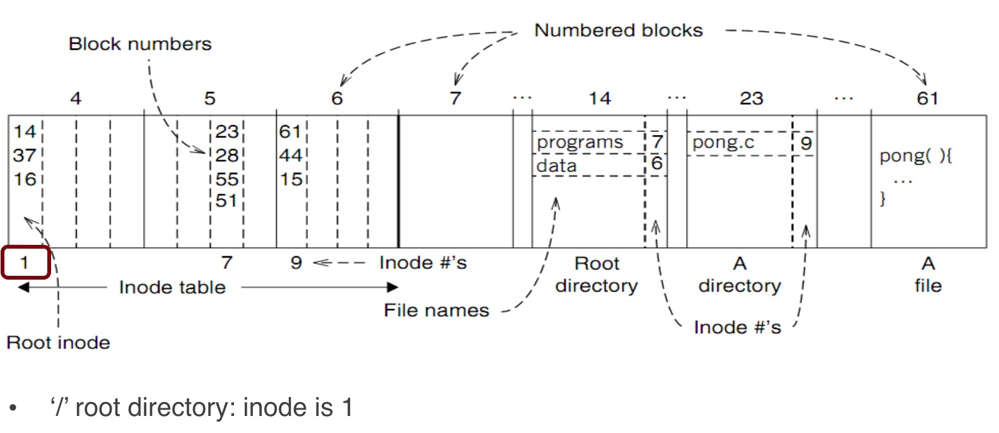
    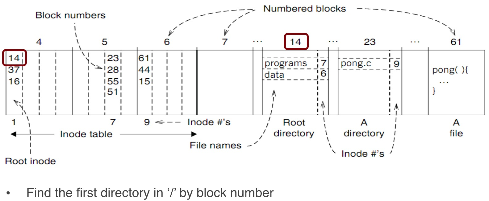
    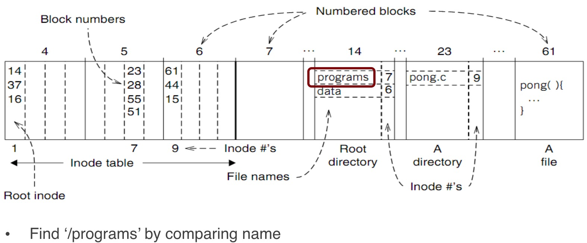
    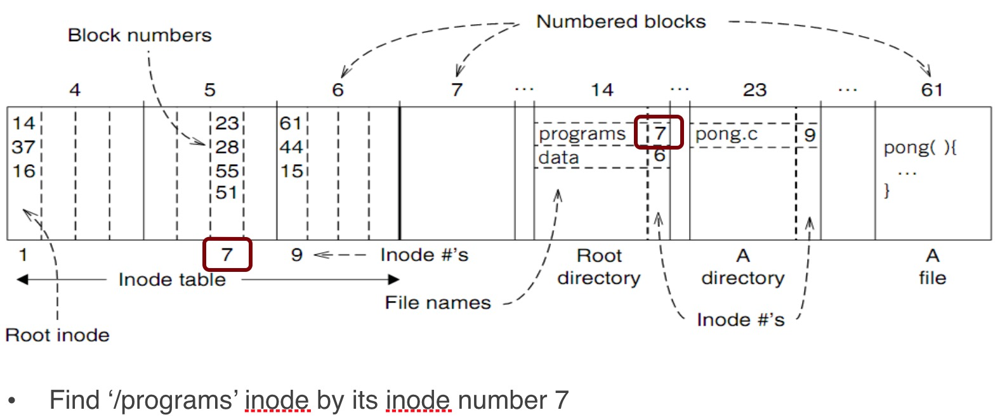
    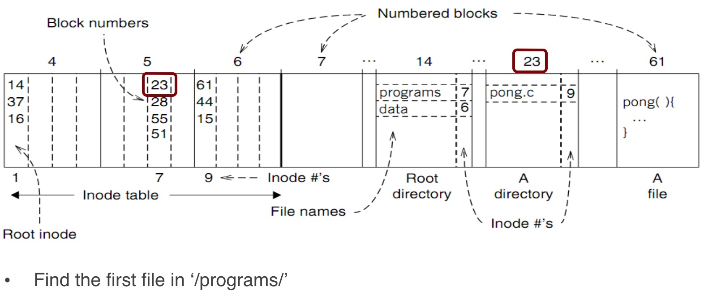
    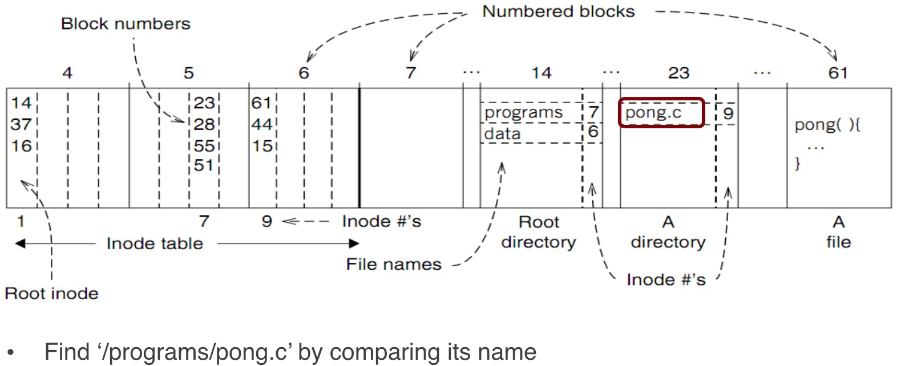
    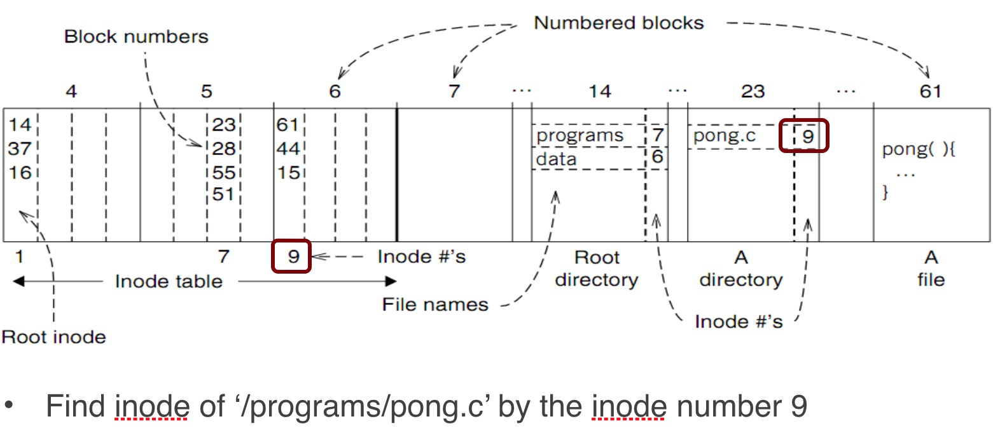
    
    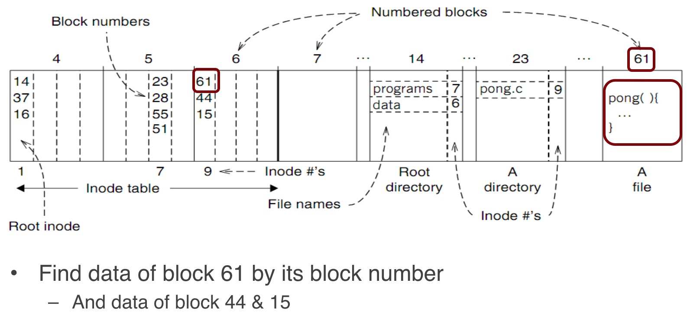

### L7: Symbolic Link Layer
- MOUNT
    - Record the device and the root inode number of the file system in memory
    - Record in the in-memory version of the inode for "/dev/fd1" its parent's inode
    - UNMOUNT undoes the mount

将某<b>设备</b>（或者另一个文件系统）挂载到Linux的一个文件夹下。比如 硬盘设备、iso文件

- Change to the file name layer
    - If LOOKUP runs into an inode on which a file system is mount, it uses the root inode of that file system for the lookup
-  Name files on other disks
    - inode is different on other disks
    - Support to attach new disks to the name space
- Two options
    - Make inodes unique across all disks - <b>显然不可行！！！</b>
    - Create synonyms for the files on the other disk
- Soft link(symbolic link)
    - SYMLINK
    - Add another type of inode

## Other Choices than inode
- Method-1:
    - Use continue blocks
    - Re-allocate if the file expands
    - E.g., data in memory
    - Why not?

- Method-2: Use Linked List
    - Each block links to its next block
    - Use special one as EOF
    - E.g., FAT32
    - Why not?
    - Answer:
        - 使用32bit存储文件大小，所以至多 2^32-1 ≈ 4GB
        - 链表结构类似于ics某个lab，容易有很多碎片产生

- How to integrate different FS?
    - vnode 
    - Interface is similar with inode

## Two Types of Links (Synonyms 同义词)

- Add link "assignment" to "Mail/new-assignment"
    - <b>Hard link</b> 上一章中所实现的 LINK，新增一个 filename 指向同一个 inode
        - No new file is created
        - Just add a binding between a string and an existing node
        - Target inode reference count is increased
        - If target file is deleted, the link is still valid
    - <b>Soft link</b> 类似于快捷方式，记录目标文件的 路径，本质上新建一个文件
        - A new file is created, the data is the string "Mail/new-assignment"
        - Target inode reference count is not increased
        - If target file is deleted, the link is not valid
- Soft link can create cycle by SYMLINK("a","a")

    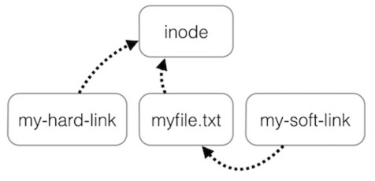

- Example
    - Suppose /tmp/abc is not existed at first
```
$ ln -s "/tmp/abc" slink
$ ls -l slink
7536945 lrwxrwxrwx 1 xiayubin 8 Sep 20 08:01 slink -> /tmp/abc
$ readlink slink
/tmp/abc
$ cat slink
cat: slink: No such file or directory
$ echo "hello, world" > /tmp/abc
$ cat slink
hello, world
```

- Comparision of Soft and Hard Link

| Item | Hard Link | Symbolic Link |
|------|-----------|---------------|
| Name resolution | Faster. A hard link contains a direct reference to the object. | Slower. It contains a path name to the object|
| Object Existence | Required | Optional |
| Object deletion | Restricted. All hard links must be unlinked to delete it. | Unrestricted. An object can be deleted even with some symbolic links |
| Dynamic Objects(attributes change) | Slower. The changes are also stored in each hard link. | Faster. Symbolic links won't be affected at all. |
| Static Objects(attributes do not change) | Faster. Name resolution is the primary performance concern. | Slower. |
| Scope | Restricted. It cannot cross file systems. | Unrestricted. |

## Sidebar: Context Change
- Current directory is "/Scholarly/programs/www"
- This dir contains a soft link
    - "CSE-web -> "Scholarly/programs/www"
- Run
```
$ cd CSE-web
$ cd ..
```
- Current dir ?
    - "/Scholaryly/programs/www"
    - ".." is resolved by bash, not by file system. (Cache)

## Summary of File System 7 Layers
- File name is not part of file (neither data nor metadata)
    - Name is not a part of an inode
    - Name is actually the data of a directory
    - An inode can have several names(hard link)
- Hard links are equal
    - If a file has two names, both are links
- Directory size is small
    - Onl mapping from name to inode number
    - "Folder" is somewhat misleading

# File System API
- Implemented as system calls to user applications
    - Kernel has many sets of function pointers implementing the API
    - Each set is specific to a FS (chose at mount point)

## File Meta-data
- Owner ID
    - User ID and group ID that own this inode
- Types of permission
    - Owner, group, other
    - Read, write, execute
- Time stamps
    - Last access (by READ)
    - Last modification (by WRITE)
    - Last change of inode (by LINK)

```
structure inode
    integer block_numbers[N]
    integer size
    integer type
    integer refcnt
    integer userid
    integer groupid
    integer mode
    integer atime
    integer mtime
    integer ctime
```

## OPEN A File
- Check user's permission
- Update last access time
- Return a short name for a file
    - File descriptor (fd)
    - Used by READ, WRITE, CLOSE, etc.

## File Descriptor
- Each process starts with three open files
    - Standard in: fd=0, standard out: fd=1, standard error: fd=2
- We can also use fd to name opened devices
    - Keyboard, display, etc.
    - Allow a designer not to worry about input/output
        - Just read from fd 0 and write to fd 1
- Each process has its own <b><i>fd name space</i></b>

## File Cursor
- File cursor
    - Keep track of operation position within a file
    - It can be changed by SEEK operation
- Case-1: Share file cursor
    - Parent passes its fd to its child
        - In UNIX, child inherits all open fds from its parent
    - Allow parent and child to share an output file
- Case-2: Not sharing file cursor
    - Two processes open the same file

## fd_table & file_table
- One file_table for the whole system
    - Records info for opened files
    - inode num, file cursor, ref_cnt of opening processes
    - Children can share the cursor with their parent
- One fd_table for each process
    - Records mapping of fd to index of the file_table

    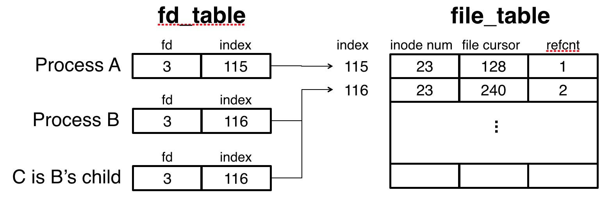

- Example - As is shown above
    - Process A, B and C all open just one file with inode number 23
    - Process A and B open the same file, not share file cursor
    - Process B and C share the file cursor

## OPEN implementation
```
procedure OPEN(character string filename, flags, mode)
    inode_number <- PATH_TO_INODE_NUMBER(filename, wd)
    if inode_number = FAILURE and flags = O_CREATE then    //Create the file?
        inode_number <- CREATE(filename, mode)
    if inode_number = FAILURE then
        return FAILURE
    inode <- INODE_NUMBER_TO_INODE(inode_number)
    if PERMITTED(inode, flags) then                        //Permission check
        file_index <- INSERT(file_table, inode_number)     
        fd <- FIND_UNUSED_ENTRY(fd_table)                  //Find entry in fd_table
        fd_table[fd] <- file_index                         // Record file index for fd
        return fd
    else return FAILURE
```

## READ implementation
```
procedure READ(fd, character array reference buf, n)
    file_index <- fd_table[fd]
    cursor <- file_table[file_index].cursor
    inode <- INODE_NUMBER_TO_INODE(file_table[file_index].inode_number)
    m = MINIMUM(inode.size - cursor, n)
    atime of inode <- NOW()
    if m=0 then return END_OF_FILE
    for i from 0 to m-1 do
        b <- INODE_NUMBER_TO_BLOCK(i, inode_number)
        COPY(b, buf, MINIMUM(m-i, BLOCKSIZE))
        i <- i + MINIMUM(m-i, BLOCKSIZE)
    file_table[file_index].cursor <- cursor + m
    return m
```

## File Open & Read Time line

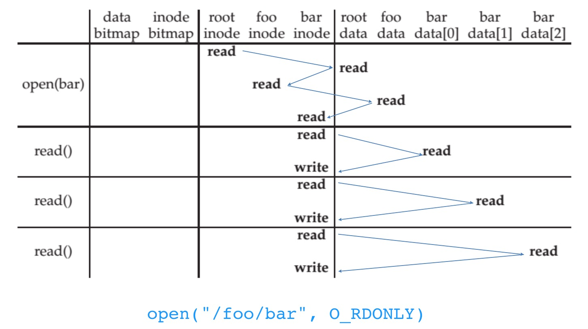

## File Creation Time line

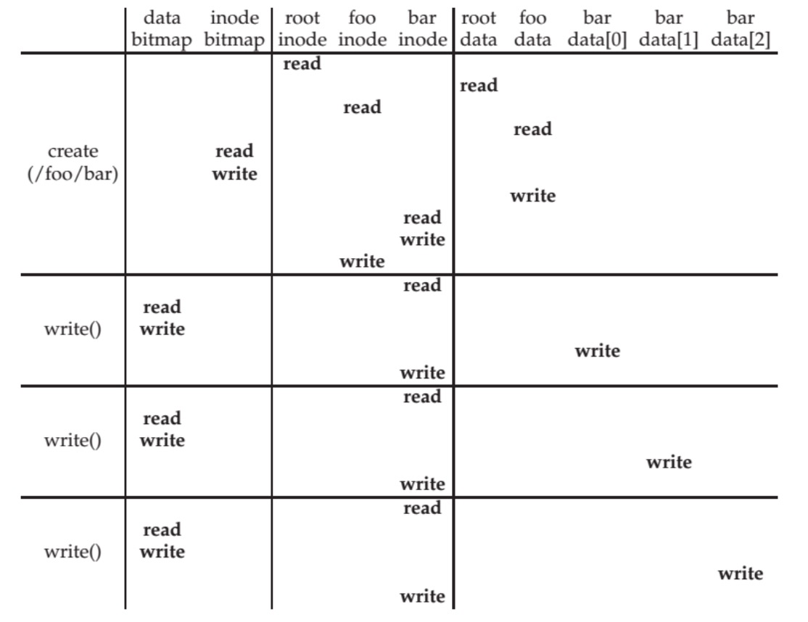

## WRITE & CLOSE
- WRITE is similar to READ
    - Allocate new block if necessary
    - Update inode's size and mtime
- CLOSE
    - FREE the entry in the fd_table
    - Decrease the ref_cnt in file table
    - Free the entry in file table if counter is 0
- <b>Failures in the middle way may cause inconsistency!</b>

- Questions
    - When writing, which order is preferred?
        - Allocate new blocks, write new data, update size
            - 中途断电，size 没更新，新分配的 block 不属于该文件。但是分配新 block 后 block map 中，刚刚分配的 block 处于不可用状态，导致这些 block 始终处于不可用状态
        - Allocate new blocks, update size, write new data
            - 同上
        - Update size, allocate new blocks, wrte new data
            - 中途断电，size 变大，但是并没有新分配 block，下次再读这个文件，会可能读到其他文件

## Delete after OPEN but before CLOSE
    - One process has OPEN a file
    - Another one removes the last name pointing to the file
        - ref_cnt is now 0
    - The inode is not freed until the first process calls CLOSE

## SYNC
- Block cache
    - Cache of recently used disk blocks
    - Read from disk if cache miss
    - Delay the writes for batching
    - Improve performance
    - Problem: may cause inconsistency if fail before write
- SYNC
    - Ensure all changes to the file have been written to the storage device

# Disk I/O

Interrupt, PIO, MMIO, DMA

## Canonical(权威性的) I/O Protocal

### A Canonical Device
- Interface
    - Registers
        - Status
        - Address
        - Data
        - Command
- Internals
    - CPU
    - Memory
    - ...

### A Canonical Protocol
```
While(STATUS == BUSY)
    ; // wait until it is not busy
Write data to DATA register and address to ADDRESS register
Write command to COMMAND register
    (Doing so starts the device and executes the command)
While(STATUS == BUSY)
    ; // wait until device is done with your request
```

- Problem: polling ( the while loop for waiting) wastes too much CPU
- Solution: using interrupts

## Interrupts

### Lowering CPU Overhead With Interrupts
- Instead of polling, the OS can issue a request, put the calling process to sleep, and context switch to anoter task
- When the device finishes, it will raise a hardware interrupt
- Te CPU jmps into the OS at a pre-determined interrupt service routine(ISR) or more simply an interrupt handler
- The handler is just a piece of OS code that will finish the request
    - For example, by reading data and perhaps an error code from the device, and wake the process waiting for the I/O, which can then proceed as desired

- Example: Keyboard

按下键盘时，键盘向处理器 SEND 一条包含 key value 的信息，处理器此时正在处理其他进程，因此会先将该信息存储到临时寄存器中，告诉键盘处理好了，同时给处理器 SEND 一个中断信号。处理器在下个 cycle 中处理该中断，把键盘按的值 SEND 至内存

- 但这仅对速度慢的设备有效

### Problem of Interrupt: Livelock
- Using interrupts arises in networks
    - 大量数据包发来，每个数据包都发一个中断信号，会导致 livelock
    - 什么是 Livelock：CPU 始终在内核级别处理中断，而从未让用户级别的进程实际运行
- Solution: Hybrid
    - Default using interrupt
    - When an interrupt happens， handle it and <b>polling</b> for a while to solve subsequence requests
    - If no further request or time-out, fall back to interrupt again
    - Used in Linux network driver with the name NAPI (New API)

### Interrupt Coalescing for Optimization
- 需要向 CPU 发中断请求之前，wait for a bit
- 将很多中断请求合并为一个中断请求，降低处理中断的 overhead
- Note: waiting too long will increase latency
    - Trade-off

## DMA

### DMA for Disk Device
- DMA
    - A processor SENDs a request to disk controller to READ a block of data
    - Including the address of a buffer in memory
- The disk SENDs the data directly to memory
    - Incrementing the memory address appropriately

- Example
    - Read
        - DMA 从磁盘读取数据时，由于 Cache 的存在，没有 DMA 则需要 CPU 先将 Memory 写入 Disk，再从 Disk 读取；有了 DMA 后，直接从 Memory 读取缓存中那部分（此时 CPU 就可以做其他事情），再从 Disk 读取剩余部分
    - Write
        - 将 Memory 中的值写入 Disk 时，没有 DMA 则需要先将 Memory 中的值取出并存入 Register，再将 Register 的值存入 Disk；有了 DMA 则直接由 Disk 取出 Memory 中的值即可
- Benefits for DMA
    - Relieve the CPU’s load to execute other program
    - Reduce one transfer (original two) (本来要先将 Memory 写入 Disk 中 )
    - Take better advantage of long message if the bus supports
    - Amortize the overhead of the bus protocol

### Methods of Device Interaction
- Method-1: PIO through I/O instructions (Kernel Mode)
    - On x86, in and out instructions
    - It must be executed in privileged mode.
- Method-2: Memory-mapped I/O (User Mode)
    - Using LOAD and STORE
    - Can also be executed in unprivileged mode

#### Method-1: I/O instruction
```
out %eax, 0x120
```
- Example: 
    - send data to a device by out instruction
    - Specify a register with data (%eax)
    - Specific an I/O Port which names the device (0x120)
        - I/O port: another name space, not physical memory space
- Privileged instructions
    - Only the OS can directly communicate with devices
- 直接通过 I/O port 访问

#### Method-2: Memory Mapped I/O
- Use LOAD and STORE instructions to address the register and buffer of the I/O modules
    - Just like access memory
    - Address is overloaded name with location info
- Provide a uniform interface to bus modules
    - MMU translates virtual address to physical address
        - Physical address is system bus address
    - I/O modules translate bus address to register address internally

将设备的寄存器和缓存映射到内存中进行访问

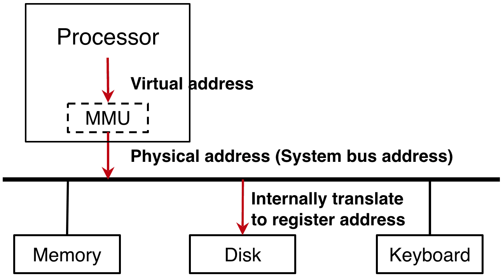

- Example
    - 如果不使用 volatile 那么编译器会认为 cid = *pcid 是无意义的操作，将第二个 printf() 优化掉。但是由于 Memory Mapped， *pcid 是完全有可能发生改变的

```
void main(void) 
{
    void          *pdev = (void *) 0x40400000;
    size_t         size = (1024*1024);
    int           *base;
    volatile int  *pcid, cid;

    base = mmap(pdev, size, PROT_READ|PROT_WRITE, 
                MAP_ANONYMOUS|MAP_PRIVATE, -1, 0);
    if (base == MAP_FAILED) errx(1, "mmap failure");

    pcid = (int *) (((void *) base) + 0xf0704);
    cid = *pcid;
    printf(“cid = %d\n", cid);
    cid = *pcid;
    printf(“cid = %d\n", cid);
   
    munmap(base, size);
}
```

- Another Example
    - 汇编代码修改了 i 的值，但编译器不知道，若不加 volatile 修饰，编译器同样会将第二个 printf() 优化掉， printf("i= 10\n");
```
#include <stdio.h>

void main()
{
    int i = 10;
    int a = i;
        
    printf("i= %d\n",a);

    // Change value of i
    __asm {
          mov dword ptr [ebp-4], 20h
    }
        
    int b = i;
    printf("i= %d\n",b); 
} 
```

## Case Study: IDE Driver using PIO
- PPT 中代码均省略
- What is the process of disk write?
    - CPU waits for disk to be ready (ide_wait_ready)
    - CPU sends WRITE request to disk (which block to write? LBA)
    - CPU transfers data to the disk (outsl(0x1f0, b->data, 512/4))
    - CPU waits (CPU switches to another thread)
    - …
    - Disk finishes write (data maybe in disk’s buffer)
    - Disk sends an interrupt to CPU
    - CPU wakes up the waiting thread
- What is the process of disk read?
    - CPU waits for disk to be ready (ide_wait_ready)
    - CPU sends READ request to disk (which block to read? LBA)
    - CPU waits (CPU switches to another thread)
    - … (can be a long time)
    - Disk finishes read (data now in disk’s buffer)
    - Disk sends an interrupt to CPU
    - CPU reads data from disk’s buffer to memory (insl(0x1f0, b->data, 512/4))
    - CPU wakes up the waiting thread

# Bus

## Bus: A Hardware Layer
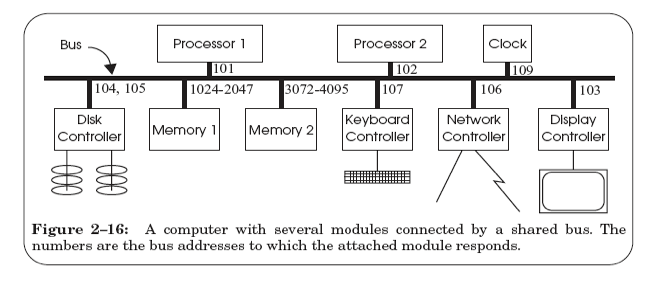

- Features
    - A set of wires
        - Comprising address, data, control lines that connect to a bus interface on each module
    - Broadcast link
        - Every module hears every message
        - Bus address: identify the intended recipient, as the name
    - Bus arbitration protocol
        - Decide which module may send or receive message at any particular time
        - Bus arbiter (optional): a circuit to choose which modules can use the bus 控制器

## Bus Transaction

- 总线工作流程
    - Source module requires exclusive use of the bus: the data sender
    - Source module places a bus address of the destine module on the bus
    - Source module signals READY wire to alert the other module
    - The destine module singles ACKNOWLEDGE wire after copied the data
        - If synchronized, then READY & ACKNOWLEDGE are not needed, just need to check the address lines on each clock cycle
    - Source module releases the bus
- Example: DMA on Bus
    - Processor #2 => all bus modules: {1742, READ, 102}
    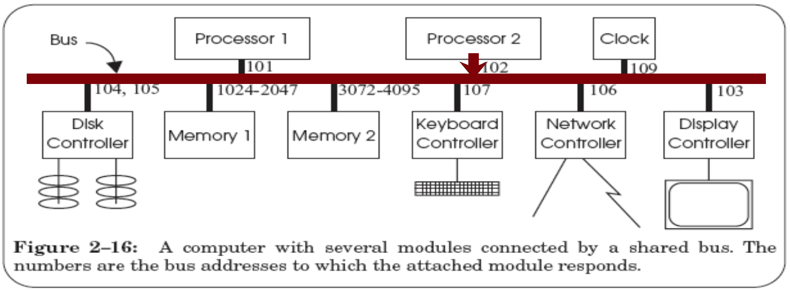
    - Memory 1 recognizes the address is within its range
    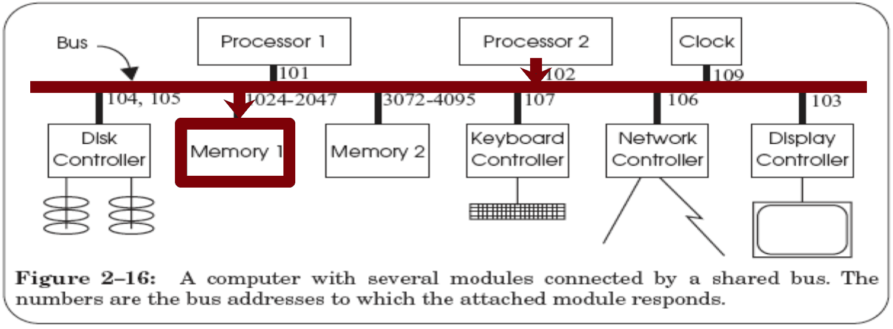
        - By examining just a few high-order address bits
    - Memory 1 acknowledges and processor 2 releases the bus
    - Memory 1 performs the internal operation to get the value
    
        - value <- READ (1742)
    - Memory1 => all bus modules: {102, value}
    
    - Processor 2 is waiting for this result, just copies the data on the bus to its register R1
    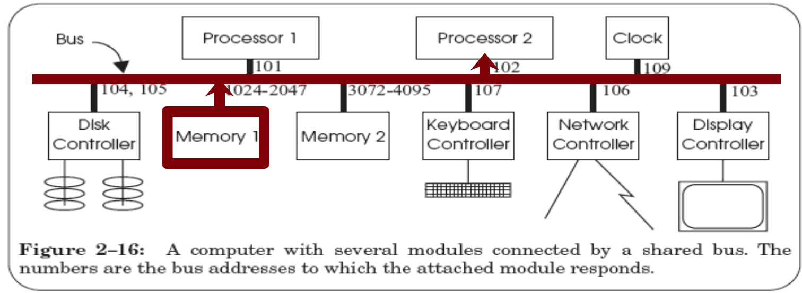
    - Processor 2 acknowledges and memory 1 releases the bus
    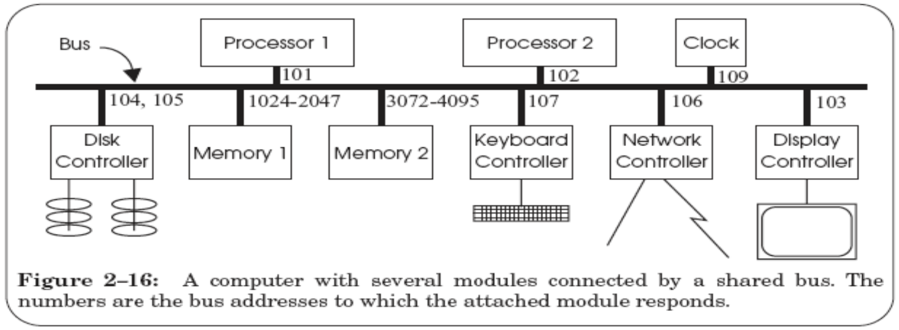

## Sync VS. Async
- Sync data transfer
    - Source & destination cooperate through a shared clock
- Async data transfer
    - Source and destination cooperate through explicit signal line
    - E.g., acknowledge line (bus just mentioned)

## Summary

- CPU interacts with physical memory
    - Through system bus that connects each other
    - Using physical address to name memory content
- CPU interacts with a device
    - Also using physical address (aka., bus address)
    - Polling, interrupt and DMA
    - I/O instruction (PIO) or MMIO

- Memory Load/Store
    - Between CPU and memory
    - Physical memory address space
- I/O Operations
    - MMIO: map device memory and registers into physical address space
- DMA
    Also using physical address

PIO 直接通过 I/O port 访问， MMIO 映射为物理地址后，CPU 直接通过总线访问设备


### Question

- How are the physical addresses assigned?
    - Memory physical addresses: by BIOS
    - Some devices (e.g., keyboard, IDE): fixed for all time
    - Other devices: assigned by the OS
- Why not map the whole disk to memory?
    - So that the CPU can access a byte on the disk directly by system bus
    - 1. Too large
    - 2. Too slow

# Naming Scheme

## Naming for Modularity

- <b>Retrieval</b>: e.g., using URL to get a web page
- <b>Sharing</b>: e.g., passing an object reference to a function
    - Save space as well: only sending the name, not the object
- <b>Hiding</b>: e.g., using a file name without knowing file system
    - Can support access control: use an object only if knowing its name
    - E.g., Windows has many undocumented API
- <b>User-friendly identifiers</b>: e.g., “homework.txt” instead of 0x051DE540
- <b>Indirection</b>: e.g., OS can move the location of the file data without notifying the user
    - Have you ever defragmented your hard driver?

## Addresses as Names
- Software
    - Memory addresses
- Hardware modules connected to the bus
    - Bus addresses

## Naming Scheme
- A naming schemes contains three parts:
    1. Set of all possible names 
        - You cannot use ‘for’ as a variable in C
    2. Set of all possible values 
    3. Look-up algorithm to translate a name into a value 
or a set of values, or “none”
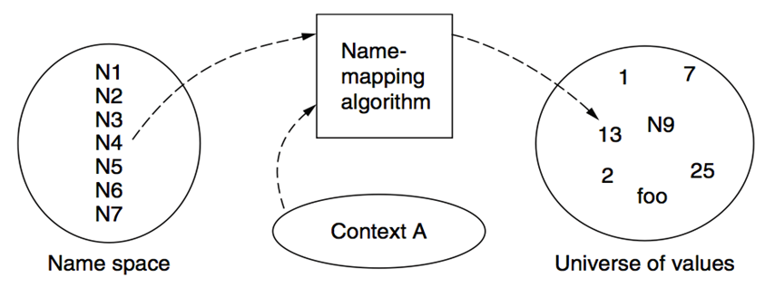

## Naming Terminology (术语)
- <b>Binding</b> – A mapping from a name to value
    - <b>Unbind</b> is to delete the mapping
    - A name that has a mapping is <b>bound</b>
- A name mapping algorithm <b>resolve</b>s a name

## Naming Context
- Type-1: context and name are separated
    - E.g., inode number’s context is the file system
- Type-2: context is part of the name
    - E.g., xiayubin@sjtu.edu.cn

- Name spaces with only one possible context are called universal name spaces
    - Example: credit card number, UUID, email address

### Determining Context

- Hard code it in the resolver
    - Examples: Many universal name spaces work this way
- Embedded in name itself
    - cse@sjtu.edu.cn: 
        - Name = "cse"
        - Context = "sjtu.edu.cn"
    - /ipads.se.sjtu.edu.cn/courses/cse/README : 
        - Name = "README"  
        - Context = "/ipads.se.sjtu.edu.cn/courses/cse"
- Taken from environment (Dynamic)
    - Unix cmd: “rm foo”: 
        - Name = “foo”, context is current dir 
        - Question: how to find the binary of "rm" command?
            - Answer: From the environment variable $PATH
    - Read memory 0x7c911109: 
        - Name = “0x7c911109”, 
        - Context is thread’s address space
- Many errors in systems due to using wrong context

## Name Mapping Algorithms
- Table lookup
    - Find name in a table
        - E.g., Phone book
- Context: which table?
    - Implicit VS. explicit
    - Default context
- Recursive lookup
    - E.g., “/usr/bin/rm”
    - First find “usr” in “/”, then find “bin” in “/usr”, then “rm”
    - Each look-up process is the same
- Multiple lookup
    - Recall: how to find “rm” without absolute name?
    - $PATH
        - E.g., “/usr/local/sbin:/usr/local/bin:/usr/sbin:/usr/bin:/sbin:/bin”
    - Look-up in a predefined list of context

## Interpreter Naming API
```
value ← RESOLVE(name, context)
    Return the mapping of name in the context

status ← BIND(name, value, context)
    Establish a name to value mapping in the context

status ← UNBIND(name, context)
    Delete name from context

list ← ENUMERATE(context)
    Return a list of all bindings

result ← COMPARE(name1, name2)
    Check if name1 and name2 are equal
```
# DNS

## DNS: Binding IP and Domain Name

- Names: hostname strings
    - E.g., www.sjtu.edu.cn
- Values: IP addresses
    - E.g., 202.120.2.119
- Look-up algorithm
    - Resolves a hostname to an IP address so that your machine knows where to send packets

## Problems of IP
- IP 不能选择
- 域名可以选择
- IP 不够 user-friendly

## Question on DNS
- Can a name have multiple values (IP addresses)?
    - Yes
    - 这样 Web Server 可以用多台机器做负载均衡
    - 允许 client 选择最近的服务器访问
- Can a single value have multiple names?
    - Yes
    - This allows server consolidation
- Can the value corresponding to a name change?
    - Yes
    - This allows to change the physical machine (with different IP) that stores the data without changing the hostname
    - Such changing is hidden to clients

## Look-up Algorithm
- Table look-up
    - hosts.txt
    - but cannot scale in the internet
- Berkeley Internet Name Domain (BIND)
    - still in use

## Distributing Responsibility
- The binding
    - Too large to be stored on a single machine
    - Thus, the data are stored on many machines
        - As known as “name servers”
- How to know which name server has a particular binding?
    - Solution: structure the hostname
    - Names have a hierarchy, e.g., com, net, gov, correspond to “zones”
    - Zones are mapped to name servers
- Zone Example
    - The root zone
        - Maintained by ICANN, non-profit
    - The “.com” zone
        - Maintained by VeriSign, add for money
    - The “.sjtu.edu.cn” zone
        - Maintained by SJTU

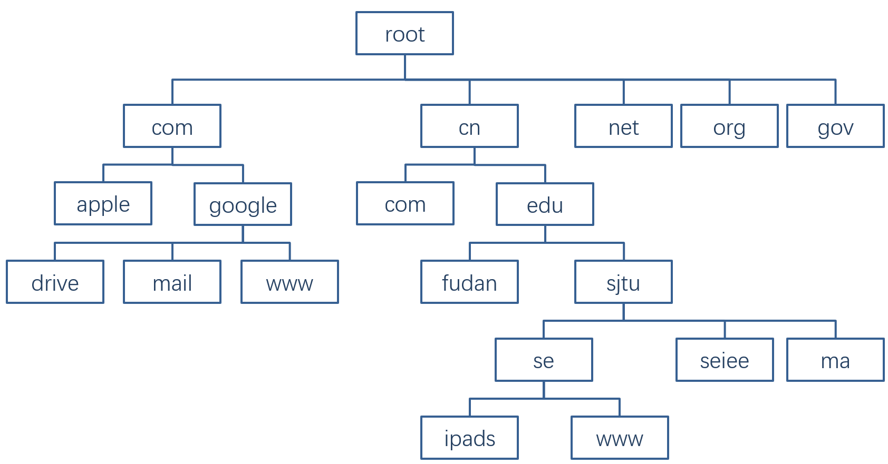

## Basic DNS Look-up Algorithm

- Example: lookup IP of “ipads.se.sjtu.edu.cn”
- Traverse the name hierarchy from the root
    - The root will tell us the “cn” name server IP,
    - which will tell us the “edu.cn” name server IP,
    - which will tell us the “sjtu.edu.cn” name server IP,
    - which will tell us the “se.sjtu.edu.cn” name server IP,
    - which finally tells us the “ipads.se.sjtu.edu.cn” IP
- Such algorithm is called delegation

## Context in DNS

- Names in DNS are global (context-free)
    - A hostname means the same thing everywhere in DNS
- Actually, it should be “ipads.se.sjtu.edu.cn.”
    - A hostname is a list of domain names concatenated with dots
    - The root domain is unnamed, i.e., “.” + blank

## Fault Tolerant
- Each zone can have multiple name servers
    - A delegation usually contains a list of name servers
    - If one name server is down, the others can be used
    - 单点故障

## Three Enhancement on Look-up
1. The initial DNS request can go to any name server, not just the root server
    - Even on your own machine: /etc/hosts
    - You can specific name servers in /etc/resolv.conf
    - If no record, just returns address of the root server
2. Recursion
    - 用户去各个 DNS 服务器查找，转变为 DNS 服务器去下一个 DNS 服务器查找
        - 服务器负荷过大
    - A client asks a name server “www.baidu.com”
    - The name server does all the lookup through the tree and return the IP of Baidu to the client
    - Usually, a name server has a better network connection
3. Caching
    - DNS clients and name servers keep a cache of names
        - Your browser will not do two look-ups for one address
    - Cache has expire time limit
        - Controlled by a time-to-live parameter in the response itself
        - E.g., SJTU sets the TTL of www.sjtu.edu.cn to 24h
    - TTL (Time To Live)
        - Long TTL VS. short TTL
        - Q: what are the tradeoffs?
            - Too long: 域名对应的服务器改了，但是你访问不到，也不会去 DNS 服务器重新查找
            - Too short: 又要不断访问 DNS 服务器，性能堪忧，服务器负载大

### Combine These Enhancement
- If
    - Many machines at SJTU use the SJTU name server for their initial DNS query
    - The name server offers recursive querying and caching
- Then
    - The name server’s cache will holding many bindings
    - Performance benefits from this large cache

## Other Features of DNS
- At least two identical replica servers
    - 80 replicas of the root name server in 2008
    - Replicas are placed separated around the world
- Organization’s name server (e.g., SJTU)
    - Several replicas in campus
        - To enable communications within the organization
    - At least one out of the campus
        - To validate the address for outside world

## Comparing Hostname & Filename
- They are both for more user friendly
    - File name -> inode number
    - Hostname -> IP address
    - The file name and hostname are hierarchical; inode num and IP address are plane
- They are both not a part of the object
    - File name is not a part of a file (stored in directory)
    - Hostname is not a part of a website (stored on name server)
- Name and value binding
    - File:   1-name -> N-values (no); N-name -> 1-value (yes)
    - DNS: 1-name -> N-values (yes); N-name -> 1-value (yes)

# Behind the DNS Design

## Benefits of Hierarchical Design

- Hierarchies delegate responsibility
- Each zone is only responsible for a small portion
- Hierarchies also limit interaction between modules

- A type of de-centralization 

## Good Points

- Global names (assuming same root servers)
    - No need to specific a context
    - DNS has no trouble generating unique names
    - The name can also be user-friendly
- Scalable in performance
    - Simplicity: look-up is simple and can be done by a PC
    - Caching: reduce number of total queries
    - Delegation: many name severs handle lookups
- Scalable in management
    - Each zone makes its own policy decision on binding
    - Hierarchy is great here
- Fault tolerant
    - If one name server breaks, other will still work
    - Duplicated name server for a same zone

## Bad Points on DNS Design

- Policy
    - Who should control the root zone, .com zone, etc? Government?
- Significant load on root servers
    - Many DNS clients starts by talking to root server
    - Many queries for non-existent names, becomes a DoS attack
- Security
    - How does a client know if the response is correct?
    - How does VeriSign know “change Amazon.com IP” is legal?

## DNS Security

- DNS Hijack: Cutting the binding between name and IP
- DNS DoS (Denial of Service) attack
    - BAOFENG.com & DNSPod
    - 2009-5-18: DNSPod is attacked and banned
    - 2009-5-19: The Internet in China is almost down
    - Fixed timer: query for BAOFENG.com once per second!
- Solutions
    - /etc/hosts, dnsmasq, OpenDNS, etc.
    - DNS shield to defend against DoS attack

# Client & Server

## Soft Modularity

- Error leaks from one module to another
- Function call
    - Stack discipline
    - Procedure calling convention

## Why Enforced Modularity?
- Modularity itself is not enough
    - Programmers make mistakes
    - Mistakes propagate easily
    - A way to strengthen the modularity is needed


### Potential Problem in Calling

- Errors in callee may corrupt the caller’s stack
    - The caller may later compute incorrect results or fails
- Callee may return somewhere else by mistake
    - The caller may lose control completely and fail
- Callee may not store return value in R0
    - The caller may read error value and compute incorrectly
- Caller may not save temp registers before the call
    - The callee may change the registers and causes the caller incorrect
- Callee may have disasters (e.g. divided by 0)
    - Caller may terminate too, known as fate sharing
- Callee may change global variables that it shouldn’t change
    - Caller and callee may compute incorrectly or fail altogether
    - Even other procedures may be affected
- Procedure call contract provides only soft modularity
    - Attained through specifications
    - Cannot force interactions among modules to their defined interfaces

## Enforced Modularity is Needed

- Using external mechanism
    - Limits the interaction among modules
    - Reduces the opportunities for propagation of errors
    - Allows verification that a user uses a module correctly
    - Prevent an attacker from penetrating the security of a module

## C/S Model
- Separates functions (abstraction)
- Enforces that separation (enforced modularity)
- Reduce fate sharing but not eliminate it
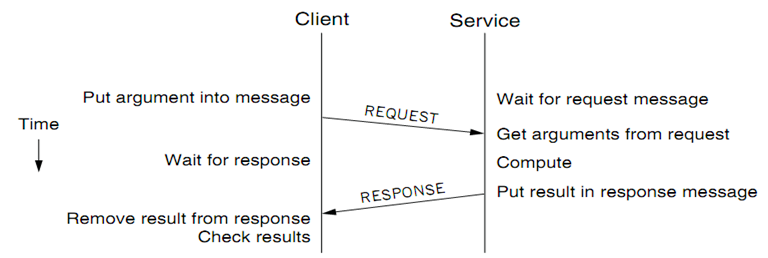

# RPC

- RPC （Remote Procedure Call)
    - Allow a procedure to execute in another address space without coding the details for the remote interaction
- RMI (Remote Method Invocation)
    - Object-oriented version of RPC, e.g. in Java


## RPC Stub

Stub: hide communication details from up-level code, so that up-level code does not change

- Client stub
    - Put the arguments into a request
    - Send the request to server
    - Wait for a response
- Service stub
    - Wait for a message
    - Get the parameters from the request
    - Call the procedure (e.g. GET_TIME)
    - Put the result into a response
    - Send the response to the client

### Client Program using RPC
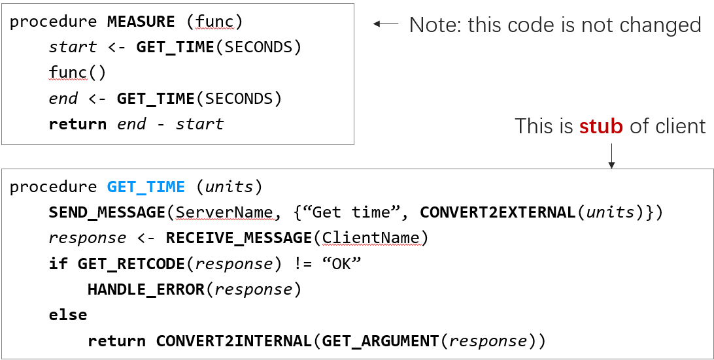

### Server Program using RPC
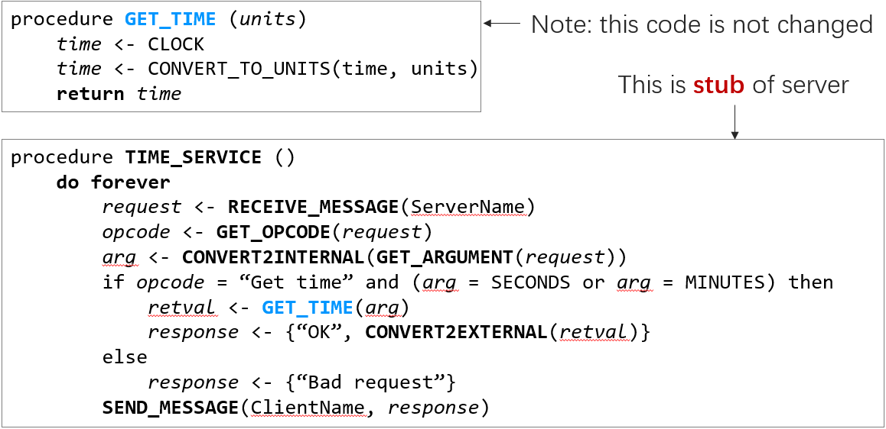

- What is inside the message
    - Service ID (e.g., function ID)
    - Service parameter (e.g., function parameter)
    - Using marshal / unmarshal (编排/逆编排 类似于 encode/decode)
        - Convert an object into an array of bytes with enough annotation so that the unmarshall procedure can convert it back into an object
        - Serialization is not easy
            - Big endian VS Little endian

### Automatic Stub Generation
- Generate stubs from an interface specification
    - Tool to look at argument and return types
    - Generate marshal and unmarshal code
    - Generate stub procedures
    - Saves programming (thus less error)
    - Ensures agreement on argument types
        - E.g., consistent function ID

## RPC 系统组成部分
1. Standards for wire format of RPC message and data types
2. Library of routines to marshal / unmarshal data
3. Stub generator, or RPC compiler, to produce "stubs”
    - For client: marshal arguments, call, wait, unmarshal reply
    - For server: unmarshal arguments, call real function, marshal reply
4. Server framework:
Dispatch each call message to correct server stub
5. Client framework:
Give each reply to correct waiting thread / callback
6. Binding: how does client find the right server? 

### Client Framework
- Keeps track of outstanding requests
    - For each, xid and caller's thread / callback
- Matches replies to caller
- Might be multiple callers using one socket
- Usually handles timing out and retransmitting

### Server Framework
- Type-1: Create a new thread per request
    - Master thread reads socket[s]
- Type-2: Use a fixed pool of threads
    - Use a queue if too many requests 
    - E.g., NFS server
- Type-3: Just one thread for serial execution
    - Simplifies concurrency, e.g., the X server

## Concurrent RPC

- Key feature: support for concurrent RPCs
    - If one RPC takes multiple blocking steps, can the server serve another one in the meantime?
        - For example, DNS service routine itself is an RPC client
    - May also avoid deadlock if one sends RPC to itself

## How to Support Different Languages?

- Can the service uses Java while client uses C?
    - Yes, they just need to use the same RPC protocol
- <b>IDL</b>: describe a function for all languages
    - <b>Interface Definition Language</b>
    - Specify names, parameters, return values, etc.
    - <b>Pre-compiler</b> use IDL to generate stubs for client/server
    - Similar to function prototypes

- IDL Example: CORBA IDL
```
module BankSimple {
   struct CustomerDetails {
     string name; 
     short age;
   };

   interface Bank {
      CustomerDetails getCustomerDetails (in string name);
   };
};
```
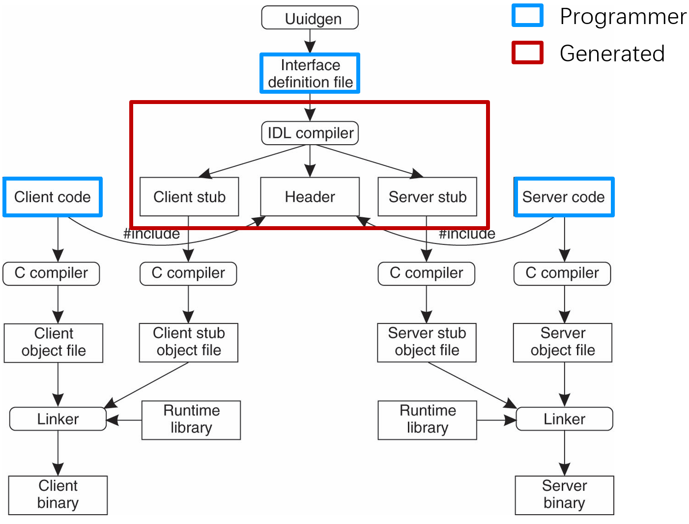

- Binding a Client to a Server: Example

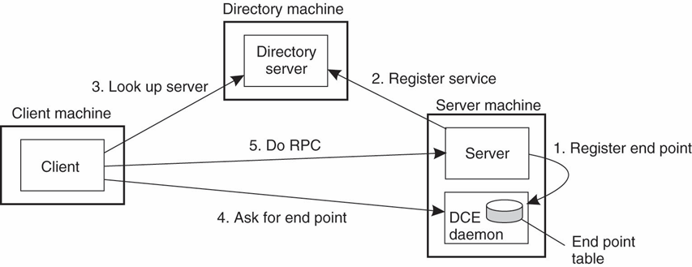

# RPC != PC

## RPC != PC
- RPCs can reduce fate sharing
    - Set a time-out for message lost or service failure
- RPCs introduce new failures: no response
- RPCs take more time
    - Stub itself may cost more than a service
    - Consider using RPC in device driver: time-out error
    - Not suitable for all cases

## Failure Handling
1. At least once
    - Client keeps resending until server responds
    - Only OK if without side effects on server
2. At most once
    - Client keeps resending (may time-out)
    - Server remembers requests and suppress duplicates?
    - Idempotent functions
3. Exactly once
    - This is often what we really want
    - Hard to do in a useful way, later in Chap-8 and 10

## Other Differences

- Language support
    - Some features do not combine well with RPC
        - E.g., inter-procedure communicate through global variable
    - Data structure that contains pointers
- Security consideration
    - Both client and server need authentication
    - Side channel attacks through network pattern (从密码系统的物理实现中获取的信息而非暴力破解法或是算法中的理论性弱点)

## Case Study: NFS

- NFS goals
    - Transparency: compatibility with existing applications
    - OS independent: clients even in DOS
    - Easy to deploy

- NFS API - No OPEN and CLOSE !
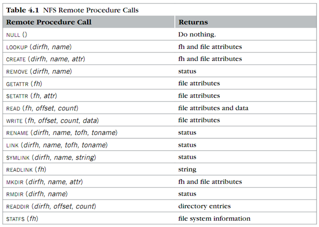

- Overview
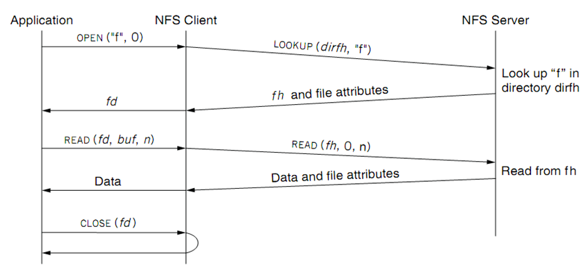

### File Handler for a Client

- File handler contains three parts
    - File system identifier: for server to identify the file system
    - inode number: for server to locate the file
    - Generation number: for server to maintain consistency of a file
        - 为了处理多人打开同一个文件的问题

- Can still work across server failures
    - E.g., server reboot
- Q: Why not put path name in the handle?
    - A: inode number / path name 二选一 （根据 path name 可以得到 inode number），显然 inode number 更快，而且能够处理 path name 出现更改的情况

### Case 1: Rename After Open
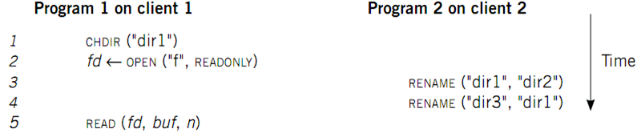

- UNIX Spec:
    - Program 1 should read “dir2/f”
    - NFS should keep the spec
    - 因此解决了之前提到的问题。fh 中留有 inode number 而不是 path name

### Stateless on NFS server
- Stateless on NFS server
    - Each RPC contains all the information
- Q: What about states like file cursor?
    - Client maintains the states, including the file cursor
- Client can repeat a request until it receives a reply (at least once)
    - Server may execute the same request twice
    - Solution: each RPC is tagged with a transaction number, and server maintains some “soft” state: reply cache
    - Q: What if the server fails between two same requests?

### Case 2: Delete After Open
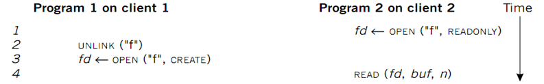

- UNIX spec:
    - On local FS, program 2 will read the old file
- How to avoid program 2 reading new file?
    - Generation number
    - "stale file handler"
- <b>Not the same as UNIX spec!</b> It’s a tradeoff...

### Cache on the Client

- NFS client maintains various caches
    - Stores a vnode for every open file
        - Know the file handles
    - Recently used vnodes, attributes, recently used blocks, mapping from path name to vnode
- Cache benefits
    - Reduce latency
    - Less RPC, reduce load on server
- Cache coherence is needed
    - Read/write coherence
        - On local file system, READ gets newest data
        - On NFS, client has cache
        - NFS could guarantee read/write coherence for every operation, or just for certain operation
    - Close-to-open consistency
        - Higher data rate
        -GETATTR when OPEN, to get last modification time
        - Compare the time with its cache
        - When CLOSE, send cached writes to the server

    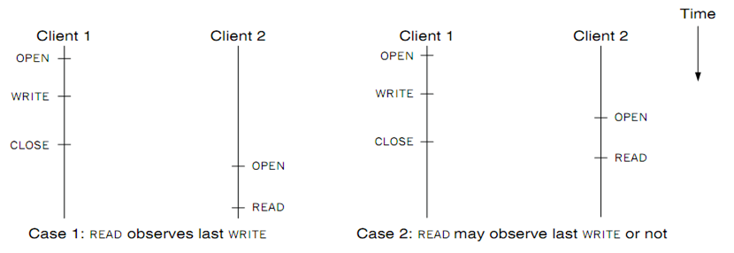

### Extend the UNIX FS to support NFS
- Vnode
    - Abstract whether a file or directory is local or remote
    - In volatile memory (why? 可看下面的图)
        - RPC 结果返回，修改了 Vnode Layer，但是代码中是不知道这次修改发生了，如果不用 volatile memory 编译器又会做优化，读取不到 Vnode Layer 发生的改动
    - Support several different local file system
    - Where should vnode layer be inserted?
- Vnode API
    - Same as we learnt: OPEN, READ, WRITE, CLOSE…
    - Code of fd_table, current dir, file name lookup, can be moved up to the file system call layer

    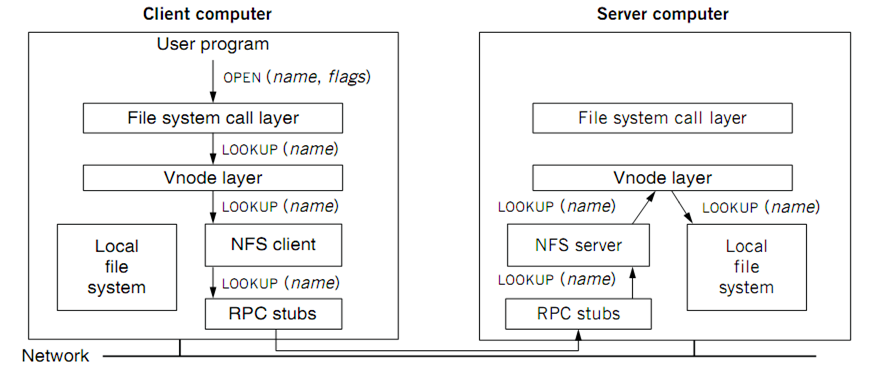


# Virtualization

- How to enforce modularity in single Machine?
    - Major challenges
        - Different modules share the same physical resources

    - Solution – Virtualization !
        - Create several virtual computers using one physical computer
        - Execute each module in its own virtual computer

    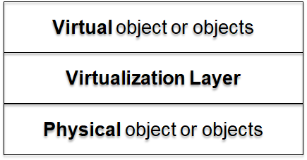

## Basic idea
    - Simulate the interface of the physical objects

## Methods
    - Multiplexing
    - Aggregating
    - Emulation

### Multiplexing
- Basic idea
    - Create multiple virtual objects by multiplexing one physical instance

    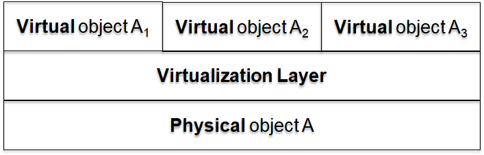

### Aggregation
- Basic idea
    - Provide one large virtual object by aggregating many physical instances

    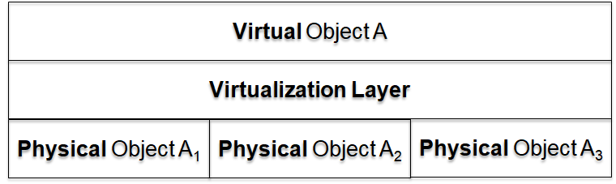

### Emulation
- Basic idea
    - Implement a virtual object from a different kind of physical object
    - Example
        - Emulate ARM on x86

    

# Virtual Memory

## Design from Scratch
- Basic assumption for simplicity
    - Each thread runs in an exclusive physical processor
    - Each module only has one thread
    - Threads are able to access the shared physical memory

- Goal: Enforce modularity 
    - One module (thread) can not access memory of other modules (threads)

## Domain Based Virtual Memory

设计过程略。简而言之，是将物理内存人为划分为固定的几块区域做虚拟化。

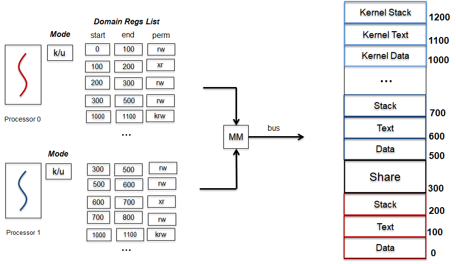

### Issues of Domain Based Virtual Memory

- Each domain has fixed size
    - Enlarging involves data movement: memory copy, relocate the old data …

- Difficult to write the program, e.g., shared library
    - Different threads have different references

因此提出 Virtual Addressing

## Virtual Addressing

- Virtual address
    - Data can be moved in real memory without being aware of 

- Virtual address space
    - Each thread is able to have the same memory layout

- Decouple modules with indirection

- Virtual address
    - A name space of physical memory

    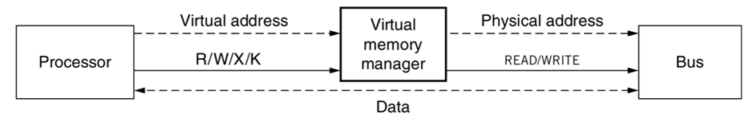

- Overview: Combined together

    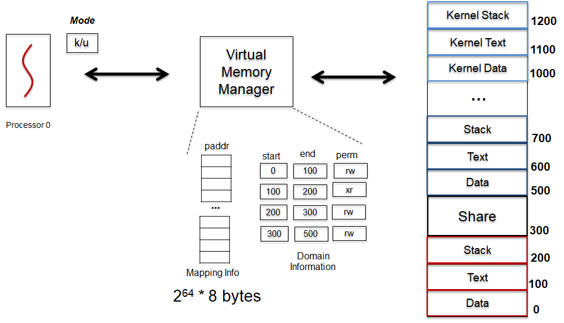

## Paging

- It is paging makes the domain size fixed, e.g., 4KB

    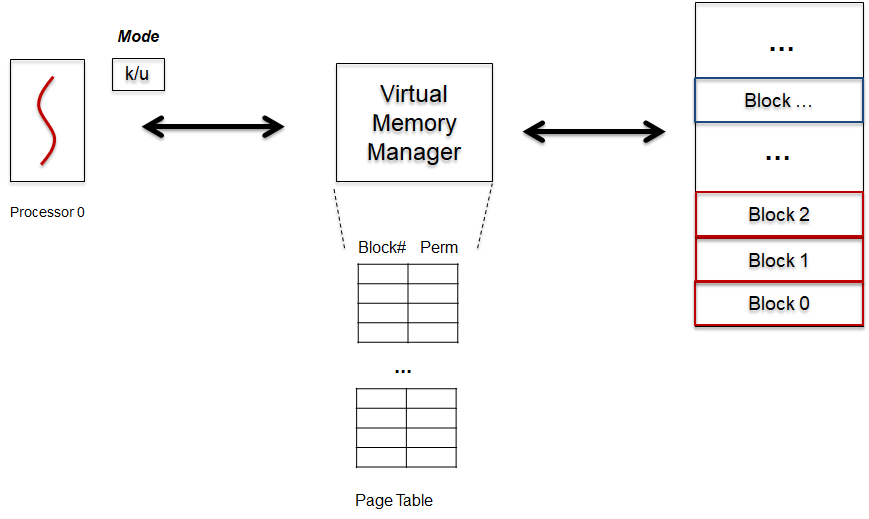

- Solution: Multi-level Paging
    - Enable demanding paging

    

## Kernel/User Mode Switching

- The machine starts in K mode
- K->U: using iret
- U->K:
    - Hardware, e.g., clock interrupt, Network/Disk interrupt
    - Software, e.g., exception, System call (e.g., int 0x80)
- Other new instructions:
    - Intel: sysenter / sysexit
    - AMD: syscall / sysret

## System Call: Library Stubs in User Mode

Use read( fd, buf, size) as an example:

```
int read( int fd, char * buf, int size) {
	move fd, buf, size to R1, R2, R3
	move READ to R0
	int $0x80 
	move result to R_result
}
```

Assume passing parameters in registers

```
EntryPoint:
	switch to kernel stack
	save context
	check R0
	call the real code pointed by R0 
	restore context
	switch to user stack
	iret (change to user mode and 	return)
```
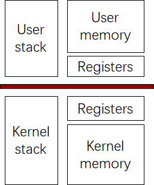

# Bounded Buffer & Lock
- Virtualizing the communication link

    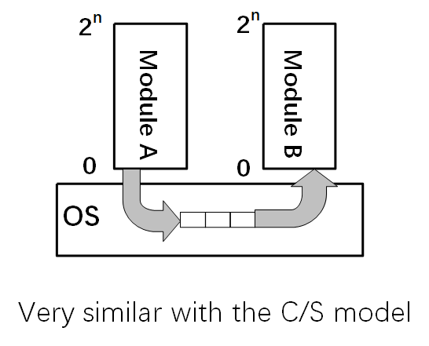

## Virtualization: C/S on a Single Machine

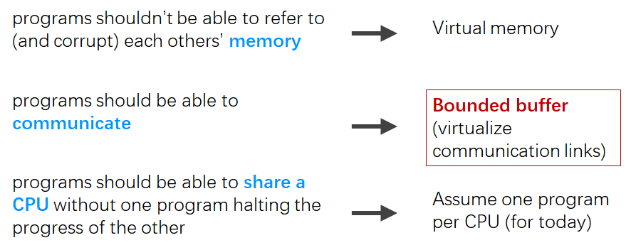

## Enforce Modularity for Bounded Buffer

- Adopt the same message-passing paradigm in C/S
    - To enable communication while keep isolation
    - Like RPC

- Share a buffer in kernel
    - User mode cannot access the buffer directly
    - Applications use API to operate the buffer
    - Must transition to kernel mode to copy messages into/from the shared buffer

## Bounded Buffer and its API
- Bounded buffer: a buffer that stores (up to) N messages

- Bounded buffer API
    - send (m)
    - m <- receive()
- SEND() and RECEIVE()
    - Supervisor calls (e.g., system calls)
    - Copy the message from/to the thread’s domain to/from the shared buffer
    - Programs running in kernel mode is written carefully
    - Transitions between user mode and kernel mode can be expensive

## Problem

- Producer and Consumer Problem 
    - Sender must wait when buffer is full 
    - Receiver must wait when buffer is empty
    - Need sequence coordination

# Bounded Buffer Implementation for single Sender

- Assumption
    - Single producer & Single consumer 
    - Each on own CPU
    - in and out do not overflow 
    - read/write coherence (e.g., on cache)
    - in and out ensure before-or-after atomicity
    - The result of executing a statement becomes visible to other threads in program order
        - Compilers do not optimize the order


```
1   send(bb, m):
2       while True:
3           if bb.in - bb.out < N:
4               bb.buf[bb.in mod N] <- m
5               bb.in <- bb.in + 1
6               return
7
8   receive(bb):
9       while True:
10          if bb.in > bb.out:
11              m <- bb.buf[bb.out mod N]
12              bb.out <- bb.out + 1
14              return m
```
4,5 不能调换，否则 bb.in 增加，若此时有个 consumer 读取 buffer ，符合条件进入 if-statement，但可能什么都没读到

# Race Condition If Multi-Senders
- Multiple Senders and Receivers

    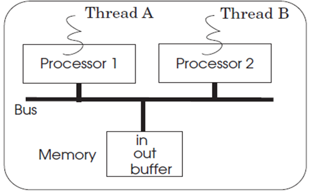

## Case 2
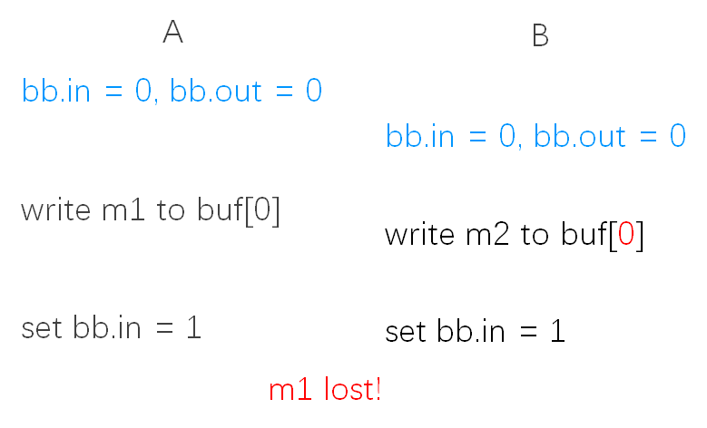

## Race Condition

- Timing dependent error involving shared state
- Whether it happens depends on how threads scheduled

- Must make sure all possible schedules are safe
    - Number of possible schedules permutations is huge
    - Bad schedules that will and will not work sometimes  
- They are intermittent 并不是很容易复现的
    - Small timing changes between invocations might result in different behavior which can hide bug (e.g., Therac-25)
    - Also known sa Heisenbugs (Heisenberg)
        - Solution-1: DMT (Deterministic Multi-Threading)
        - Solution-2: Record and Replay

# Lock to the rescue (or not?...

## Lock API

- acquire(lock) &nbsp;&nbsp;/&nbsp;&nbsp;lock(lock)
- release(lock) &nbsp;&nbsp;/&nbsp;&nbsp;unlock(lock)

- If a thread acquires a lock that is hold by another thread:
    - Case-1: Spin on current CPU with a loop (spinlock)
    - Case-2: Yield the current CPU (e.g., conditional variable)

## Using Locks

有了锁以后，开发者需要自己加锁。但是如果忘记加锁，会导致 race condition；如果忘记放锁，会导致 dead lock

## Send with Locks: Correct ?
```
send(bb, message):
    while True:
         if bb.in – bb.out < N:
              acquire(bb.send_lock)
              bb.buf[bb.in mod N] <- message
              bb.in <- bb.in + 1
              release(bb.send_lock)
              return
```

- 若同时有两个 sender，可能会两者同时进入 if-statement，但是一个拿到锁，可能会把 buffer 写满，导致另一个 sender 之后拿到锁，但是却无法写入。

## Send with Locks: Correct Version

```
send(bb, message):
      acquire(bb.send_lock)
      while True:
          if bb.in – bb.out < N:
              bb.buf[bb.in mod N] <- message
              bb.in <- bb.in + 1
              release(bb.send_lock)
              return

```
- 所以应该在拿锁之后，进行能否写入的判定，不能写入，则开始循环。

## Another Version of Send

```
send(bb, message):
    while True:
          acquire(bb.send_lock)
          if bb.in – bb.out < N:
              bb.buf[bb.in mod N] <- message
              bb.in <- bb.in + 1
              release(bb.send_lock)
              return
          release(bb.send_lock)
```
- 这种方式开销太大，每次循环都要拿锁放锁

# Implementing the Lock

## Initial Lock Implementation (Incorrect)
```
struct lock { integer state; };

void acquire (lock reference L) {
    while L.state == LOCKED
       ;               // spin until L is UNLOCKED
    L.state = LOCKED;  // the while test failed, got the lock
}
void release (lock reference L) {
    L.state = UNLOCKED;
}
```

由于原子性问题，可能有两个 consumer 同时经过 while 判定，然后拿到锁。

## Primitives to Implement Lock
- Hardware atomic instructions
    - RSM: read-set-memory
    - Test-and-set, Compare-and-swap
    - Load-linked + Store-conditional, Fetch-and-add
- Pure software solution
    - Using load and store instructions only
    - Dekker’s & Peterson’s Algorithms

### Test-and-set
```
1 int TestAndSet(int *old_ptr, int new) {
2     int old = *old_ptr; // fetch old value at old_ptr
3     *old_ptr = new; // store ‘new’ into old_ptr
4     return old; // return the old value
5 }
```
- Example - Spin Lock
```
1 typedef struct __lock_t {
2     int flag;
3 } lock_t;
4
5 void init(lock_t *lock) {
6     // 0 indicates that lock is available, 1 that it is held
7     lock->flag = 0;
8 }
9
10 void lock(lock_t *lock) {
11     while (TestAndSet(&lock->flag, 1) == 1)
12     ; // spin-wait (do nothing)
13 }
14
15 void unlock(lock_t *lock) {
16     lock->flag = 0;
17 }
```
### Compare-and-swap
```
1 int CompareAndSwap(int *ptr, int expected, int new) {
2     int actual = *ptr;
3     if (actual == expected)
4         *ptr = new;
5     return actual;
6 }
```

- Example - Spin Lock
```
1 typedef struct __lock_t {
2     int flag;
3 } lock_t;
4
5 void init(lock_t *lock) {
6     // 0 indicates that lock is available, 1 that it is held
7     lock->flag = 0;
8 }
9
10 void lock(lock_t *lock) {
11     while (CompareAndSwap(&lock->flag, 0, 1) == 1)
12     ; // spin-wait (do nothing)
13 }
14
15 void unlock(lock_t *lock) {
16     lock->flag = 0;
17 }
```

### Load-linked and Store-conditional
```
1 int LoadLinked(int *ptr) {
2     return *ptr;
3 }
4
5 int StoreConditional(int *ptr, int value) {
6     if (no one has updated *ptr since the LoadLinked to this address) {
7         *ptr = value;
8         return 1; // success!
9     } else {
10         return 0; // failed to update
11    }
12 }
```

- Example
```
1 void lock(lock_t *lock) {
2     while (1) {
3         while (LoadLinked(&lock->flag) == 1)
4             ; // spin until it’s zero
5         if (StoreConditional(&lock->flag, 1) == 1)
6             return; // if set-it-to-1 was a success: all done
7                     // otherwise: try it all over again
8     }
9 }
10
11 void unlock(lock_t *lock) {
12     lock->flag = 0;
13 }
```

### Fetch and Add
```
1 int FetchAndAdd(int *ptr) {
2     int old = *ptr;
3     *ptr = old + 1;
4     return old;
5 }
```
- Example
```
1 typedef struct __lock_t {
2     int ticket;
3     int turn;
4 } lock_t;
5
6 void lock_init(lock_t *lock) {
7     lock->ticket = 0;
8     lock->turn = 0;
9 }
10
11 void lock(lock_t *lock) {
12     int myturn = FetchAndAdd(&lock->ticket);
13     while (lock->turn != myturn)
14         ; // spin
15 }
16
17 void unlock(lock_t *lock) {
18     lock->turn = lock->turn + 1;
19 }
```

## Bootstrapping
- Solve the narrow problem using some specialized method 
- The general solution then consists of two parts: 
    - a method for solving the special case 
    - a method for reducing the general problem to the special case

## Assumption

- Bus arbiter 
    - Guarantees that any single LOAD or STORE is a before-or-after action with respect to every other LOAD and STORE
- Each entry of the shared array is:
    - in its own memory cell
    - the memory provides read/write coherence for memory cells 
- The instructions execute in program order

## The Bus Arbiter Problem

总线仲裁器可以防止其他 CPUs 读取 Memory 读一半。一些原子操作是依赖于仲裁器这一特点的。然而实现这一特性的仲裁器理论上是做不到完美的。

- Two async inputs (A, B), one sync output
    - Choose between two asynchronous input
- If inputs are closely spaced
    - Output may be oscillating
    - Waiting longer only reduce the probability of oscillating

    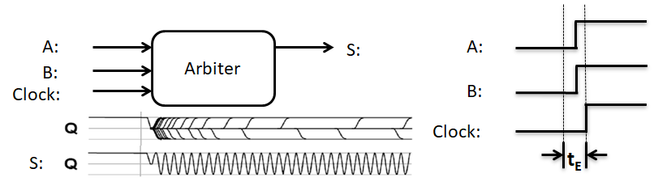

再振荡的情况下，虽然仲裁器在某个时间点，能够仲裁得到一个确认的结果，但是如果再时钟到来之前没有完成这样的工作，就会被认为是仲裁器错误。

具体错误避免方式见书 5.2.8 节 p165

## Peterson's Algorithm

- Assumptions
    - Assume loads and stores are atomic with respect to each other, which was true on early hardware
    - Does not hold on today’s hardware, which has relaxed memory consistency models
- So, not used any more
    - Using a little hardware support is much easier

```
int flag[2]; // assume two threads on two CPUs
int turn;
void init() {
    flag[0] = flag[1] = 0; // 1->thread wants to grab lock
    turn = 0; // whose turn? (thread 0 or 1?)
}
void lock() {
    flag[self] = 1; // self: thread ID of caller
    turn = 1 - self; // make it other thread’s turn
    while ((flag[1-self] == 1) && (turn == 1 - self))
        ; // spin-wait
}
void unlock() {
    flag[self] = 0; // simply undo your intent
}

```

# Lock Performance 

## Lock Granularity (粒度)

- Coarse-grain – Few locks protecting more data 粗粒度
    - \+ Simpler, easier to reason about 
    - \- Less concurrency 
- Fine-grain – Many locks protecting smaller pieces of data 细粒度
    - \+ High amount of concurrency 
    - \- More complex 
    - \- Overhead for locks 

- Example
    - File System
        - Coarse-grain
            ```
            // fs_lock one lock per file system
            move(dir1, dir2, filename):
                acquire(fs_lock)
                unlink(dir1, filename)
                link(dir2, filename)
                release(fs_lock)
            ```
        - Fine-grain
            ```
            move(dir1, dir2, filename):
                acquire(fs_lock)
                unlink(dir1, filename)
                link(dir2, filename)
                release(fs_lock)
            ```
        - Fine-grain but deadlock
            ```
            move(dir1, dir2, filename):
                acquire(dir1.lock)
                acquire(dir2.lock)
                unlink(dir1, filename)
                link(dir2, filename)
                release(dir1.lock)
                release(dir2.lock)  
            ```

# Deadlock

## Deadlock Theory

Four necessary and sufficient conditions for deadlock

- Limited access
    - Resource can only be shared with finite users. 
- No preemption (优先权) 
    - Once resource granted, cannot be taken away. 
- Multiple independent requests (hold and wait)
    - Don’t ask all at once (wait for next resource while holding current one) 
- Cycle in wait for graph

## Deadlock & Making Progress

- Inevitable if using locks in concurrency
    1. Waiting for one another
    2. Waiting for a lock by some deadlocked one
    - Correctness arguments ensures correctness, but no progress
- Methods
    - Pessimistic ones: take a priori action to prevent
    - Optimistic ones: detect deadlocks then fix up

## Methods for Solving Deadlock

- Lock ordering (pessimistic)
    - <b>Number the locks uniquely</b> 给锁加编号！！！
    - Require transactions acquire locks in order
    - Problem: some app may not predict all of the locks they need before acquiring the first one
- Backing out (optimistic)
    - <b>Number the locks uniquely</b>
    - Allow acquire locks in any order
    - If it encounters an already-acquired lock with an number lower than one it has previously acquired itself, then
        - UNDO: Back up to release its higher-numbered locks
        - Wait for the lower-numbered lock and REDO
    - 拿锁时，如果该锁被其他人占用，如果编号较小，则需要先释放编号较大的锁，然后再等待小号锁，再拿号较大的锁
- Timer expiration (optimistic)
    - Set a timer at begin_transaction, abort if timeout
    - If still no progress, another one may abort
    -   Problem: how to chose the interval?
- Cycle detection (optimistic)
    - Maintain a wait-for-graph in the lock manager
        - Shows owner and waiting ones
        - Check when transaction tries to acquire a lock
    - Prevent cycle (deadlock)
        - Select some cycle member to be a victim

- Example: Approach 4: Fine-grained Locking + Solving Deadlock
    - Lock ordering

    ```
    move(dir1, dir2, filename):
        if dir1.inum < dir2.inum:
            acquire(dir1.lock)
            acquire(dir2.lock)
        else:
            acquire(dir2.lock)
            acquire(dir1.lock)
        unlink(dir1, filename)
        link(dir2, filename)
        release(dir1.lock)
        release(dir2.lock)

    ```

## Livelock
This has been mentioned in interrupt.

- An interaction among a group of threads
    - Each thread is repeatedly performing some operatoins
        - e.g. context saving/restoring
    - But never able to complete the whole sequence of operation
        - e.g. process the network packets

## One-writer Principle 

遵循单一写原则，甚至可以不需要锁，避免了锁的 overhead 进而提升性能

- If each variable has only one writer
    - Coordination becomes easier
    - Concurrency and read-only data is easy
    - Guide: Make as much data as you can have only a single writer
- Privatization: Make data private to a thread
    - Allocate on thread stack
    - Array indexed by thread_id()
        - e.g. privateData[thread_id()]...
- Focus locking scheme on data shared read/write

# Thread
- Virtual Processor

- API
    - suspend(), resume()
- Need to capture program's state
    - Value of all registers, all of its memory
- Big question: <b>when to suspend/resume a thread?</b>

## The yield() System Call

- Why yield()? Current thread is waiting for an event
- Implementation of yield()
    - Suspends running thread: save stack pointer and page-table register
    - Chooses new thread: round-robin fashion until we hit a RUNNABLE thread (perhaps the one that just called yield)
    - Resumes thread to run: reload state all of this happens as an atomic action
- Data structures
    - threads table, CPUs table, t_lock

    ```
    yield():
    // Suspend the running thread
    // Choose a new thread
    // Resume the new thread
    ```

### Implementation of yield()

1. Suspend the running thread
    ```
    yield():
        /*  
            threads[]:
                A table 
                It contains a list of all the current threads and some info about them
                One per system
            
            cpus[]:
                A table 
                It contains a list of all CPUs and the ID of the thread currently running on them
                one per CPU

            t_lock:
                A lock protect the thread table (at least for now)
        */
        acquire(t_lock)

        id = cpus[CPU].thread
        threads[id].state = RUNNABLE    
        threads[id].sp = SP

        // Choose a new thread
        // Resume the new thread
        
        release(t_lock)

    ```
    - Question: why no cpu_lock needed?
        - Privatization of <b>One-writer Principle</b>

2. Choose a new thread
    ```
    yield():
        acquire(t_lock)

        id = cpus[CPU].thread
        threads[id].state = RUNNABLE
        threads[id].sp = SP

        do:
            id = (id + 1) mod N
        while threads[id].state != RUNNABLE

        // Resume new thread
        
        release(t_lock)
    ```

3. Resume new thread
    ```
    yield():
        acquire(t_lock)

        id = cpus[CPU].thread
        threads[id].state = RUNNABLE
        threads[id].sp = SP

        do:
            id = (id + 1) mod N
        while threads[id].state != RUNNABLE

        SP = threads[id].sp
        threads[id].state = RUNNING
        cpus[CPU].thread = id
        
        release(t_lock)
    
    /* 
        t_lock
        Atomically set threads[].state and .sp
        Atomically find a RUNNABLE thread and mark it RUNNING
    */
    ```

# Context switch
## Thread Layer and Processor Layer

- A thread runs in thread layer
    - A thread calls YIELD, <b>enters processor layer</b>
    - Saves the state of the running thread
        - General purpose regs + PC + SP + CR3
    - Chose another runnable thread
    - <b>Exit the processor layer</b> and enter thread layer
- The new thread runs in thread layer

    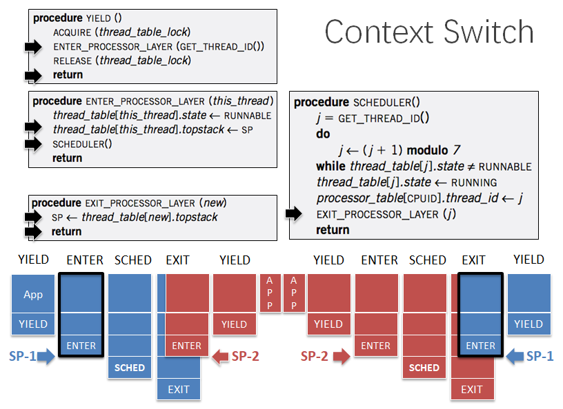

- 实际上在线程 A 执行到栈帧 SP 改变的那一刻才真正发生了 context switch。
- 然后执行 return 就已经是线程 B 的 SCHEDULER() 中。
- 再 return 跳到 线程 B 的 ENTER_PROCESSOR_LAYER()、YIELD()
- YIELD() return 之后就跳转到线程 B 的 PC。
- 线程 B 在调用 YIELD() 时，已经将 PC 存在线程 B 的栈里了

## Create a Thread

- ALLOCATE_THREAD
    - Allocate a new stack
    - Push address of EXIT_THREAD() as return address
    - Push address of starting_procedure as return address
        - starting_procedure is the start address of a thread
    - Initialize an entry in thread_table
    - Set state to RUNNABLE


## Start the Scheduler

- CPU 栈只有当运行 scheduler() 的时候才用到。
- 说到底，如果没有 CPU 栈，每次 context switch 的时候在线程栈上做操作，就污染了 CPU 栈
- 所以要先切到 CPU 栈，在 CPU 栈上做操作，保证线程栈干净

- Processor Thread
    - Create a separate thread for each processor first
    - Its stack is not used for most of the time
        - Only used when running scheduler()

    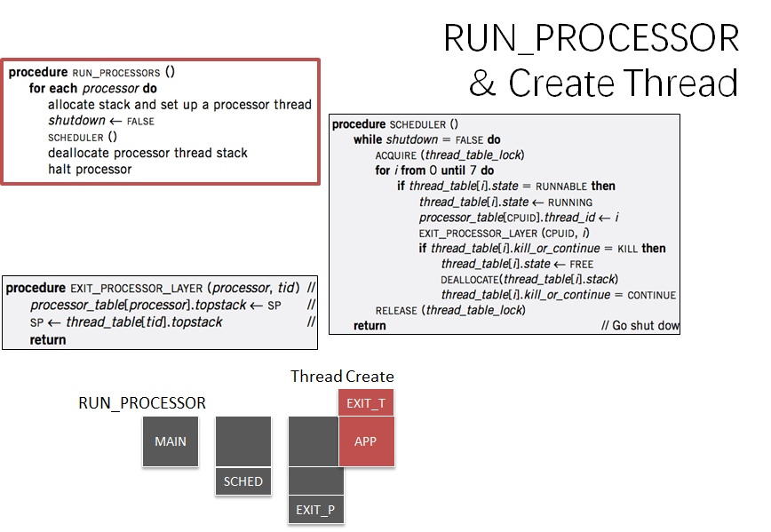

    初始化处理器。

## Thread Exit
```
1 procedure EXIT_THREAD()
2 		ACQUIRE (threadtable_lock)
3 		threadtable[tid].kill_or_continue ← KILL
4 		ENTER_PROCESSOR_LAYER (GET_THREAD_ID (), CPUID)
```

## Destroy a Thread

- DESTROY_THREAD
    - One thread kills another thread
    - Problem: the target thread may be running, thus the calling thread cannot just free its resource
    - Solution: asynchronization: set KILL and return
        - Wait for the thread to be destroyed when SCHEDULER
        - 由线程 A 将 线程 B 的状态设置为 KILL，之后进入 Processor Layer 由 SCHEDULER 摧毁线程 B
    
    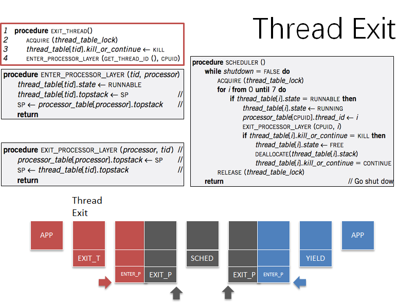
    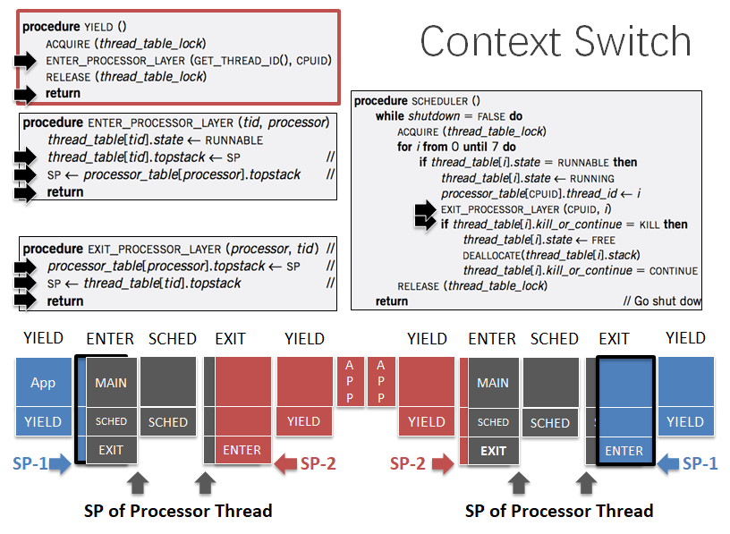

    <b>由线程 A 加锁，线程 B 放锁</b>

- Example

    

# Condition Variable
- Lock with yield()

## Bounded Buffer Send/Receive

- Only work for single sender

    ```
    send(bb, msg):
        while True:
            if bb.in – bb.out < N:
            bb.buf[bb.in mod N] <- msg
            bb.in <- bb.in + 1
            return
    ```
- Support multiple senders

    ```
    send(bb, msg):
        acquire(bb.lock)
        while True:
            if bb.in – bb.out < N:
                bb.buf[bb.in mod N] <- msg
                bb.in <- bb.in + 1
                release(bb.lock)
                return
    ```
    - Problem: lots of wasted loop

## Bounde Buffer with yield()

- Problem: a lot of unnecessary checking as well as a lot of acquiring locks

    ```
    send(bb, msg):
        acquire(bb.lock)
        while True:
            if bb.in - bb.out < N:
                bb.buf[bb.in mod N] <- msg
                bb.in <- bb.in + 1
                release(bb.lock)
                return
            release(bb.lock)
            yield()
            acquire(bb.lock)
    ```
- Better solution: the sender (receiver) just got woken up when the buffer is not full (empty)

## Condition Variables

- Condition variables are synchronization primitives that enable threads to wait until a particular condition occurs.
    - Let threads wait for events
    - The threads get notified when the events occur
- Condition variable API
    - WAIT(cv): yield processor and wait to be notified of cv
    - NOTIFY(cv): notify waiting threads of cv
- WAIT 使线程休眠，当触发条件时 NOTIFY 唤醒线程

## Really Need a While Loop with CV?

```
send(bb, msg):
    acquire(bb.lock)
    if bb.in - bb.out >= N:
        release(bb.lock)
        wait(bb.not_full)
        acquire(bb.lock)

    bb.buf[bb.in mod N] <- msg
    bb.in <- bb.in + 1
    release(bb.lock)
    notify(bb.not_empty)
    return
```

- Problem: many senders might wake up from wait() after just one receive()
- Thus, must re-check that there's still space after we re-acquired the lock (using loop)
- What happens if send() notifies but there's no receiver waiting? 
    - No one gets woken up
    - But that's OK: a later receiver will re-check (in>out)

## The Lost Notify Problem

- Condition variable itself has no memory/state
    - wait() and then notify(): wait() returns
    - notify() and then wait(): wait() does not return
        - This is potentially prone to race conditions

    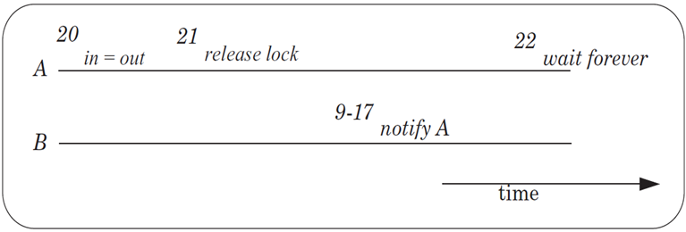

    - 先 notify 再 wait，会导致 wait forever 
    - 这个问题用新的 API 来实现
        - WAIT 将调用 yield_wait()，yield_wait()中放 t_lock 再拿 t_lock，就能允许其他线程运行，不会有上图中 wait forever 的结果。具体实现见后面 New API

## New API

- Old API
    - WAIT(cv): yield processor and wait to be notified of cv
    - NOTIFY(cv): notify waiting threads of cv
- New API
    - WAIT(cv, lock): release lock, yield CPU, wait to be notified, acquire lock
        ```
        wait(cv, lock):
            acquire(t_lock)
            release(lock)
            threads[id].cv = cv
            threads[id].state = WAITING
            yield_wait()
            release(t_lock)
            acquire(lock)
        ```
    - NOTIFY(cv): notify waiting threads of cv
        ```
        notify(cv):
            acquire(t_lock)
            for I = 0 to N-1:
                if threads[i].cv == cv && threads[i].state == WAITING:
                threads[i].state = RUNNABLE
            release(t_lock) 
        ```
    - Example: Bounded Buffer
        ```
        send(bb, msg):
            acquire(bb.lock)
            while True:
                if bb.in - bb.out < N:
                    bb.buf[bb.in mod N] <- msg
                    bb.in <- bb.in + 1
                    release(bb.lock)
                    notify(bb.not_empty)
                    return
                // No need for these following
                //release(bb.lock)
                //wait(bb.not_full)
                //acquire(bb.lock)
                wait(bb.not_full, bb.lock)
        ```
    - yield_wait()
        - Recall yield()
            ```
            yield():
                acquire(t_lock)

                id = cpus[CPU].thread
                threads[id].state = RUNNABLE
                threads[id].sp = SP

                do:
                    id = (id + 1) mod N
                while threads[id].state != RUNNABLE

                SP = threads[id].sp
                threads[id].state = RUNNING
                cpus[CPU].thread = id
                
                release(t_lock)
            ```
        - yield_wait()
            - The 1st Version: <b>Incorrect</b> !
                - Problem: what if nothing is RUNNABLE?
                    - yield_wait() will keep looping forever, while holding t_lock.
                    - Other CPUs cannot acquire t_lock, even if they want to do a notify! ==> deadlock!
                    - 这个问题是由于 wait 中引入了 WAITING 状态导致的
            ```
            yield_wait(): // called by wait()
                // 在调用 yield_wait() 之前，在 wait() 中已经做好 t_lock 的处理
            --  acquire(t_lock)               <======== IMPORTANT

                id = cpus[CPU].thread
                // 在调用 yield_wait() 之前，在 wait() 中已经将 state 设置为 WAITING
            --  threads[id].state = RUNNABLE  <======== IMPORTANT
                threads[id].sp = SP

                do:
                    id = (id + 1) mod N
                while threads[id].state != RUNNABLE

                SP = threads[id].sp
                threads[id].state = RUNNING
                cpus[CPU].thread = id
                
            --  release(t_lock)               <======== IMPORTANT
            ```
            - The 2rd Version: Still <b>Incorrect</b>
                - 通过放锁再拿锁，让其他 CPU 有机会能够运行，来避免死锁。但是会导致两个 CPU 都指向同一个线程的栈帧，使得该线程栈污染
                - Problem: Once yield_wait() releases t_lock, another CPU can run our current thread.
                    - So now two CPUs have their SP pointing to the same thread's stack!
                    - Can result in the stack being corrupted!

            ```
            yield_wait(): // called by wait()
                id = cpus[CPU].thread
                threads[id].sp = SP

                do:
                    id = (id + 1) mod N
            ++      release(t_lock)   //    <======== IMPORTANT
            ++      acquire(t_lock)   //    <======== IMPORTANT
                while threads[id].state != RUNNABLE

                SP = threads[id].sp
                threads[id].state = RUNNING
                cpus[CPU].thread = id
            ```
            - The 3rd Version
                - 切换到 CPU 栈上，避免线程栈遭到污染
                - Question: why there is no code to save the CPU’s SP?
                    - Answer: Since the loop will not call any function, the SP will not change.

            ```
            yield_wait(): // called by wait()
                id = cpus[CPU].thread
                threads[id].sp = SP
            ++  SP = cpus[CPU].stack  //    <======== IMPORTANT

                do:
                    id = (id + 1) mod N
                    release(t_lock)
                    acquire(t_lock)
                while threads[id].state != RUNNABLE

                SP = threads[id].sp
                threads[id].state = RUNNING
                cpus[CPU].thread = id
            ```
- Overview
    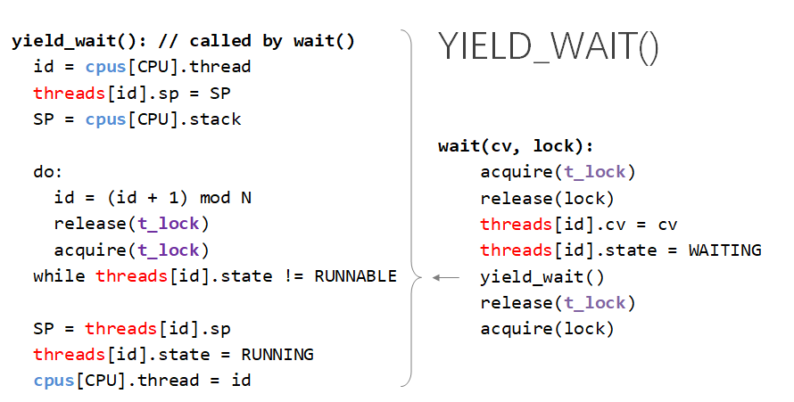
# Preemption(优先权)

## Preemption Scheduling
- Non-preemptive Scheduling 
    - A thread continues to run until it gives up its processor (e.g., EXIT)
- Cooperative Scheduling (cooperative multitasking)
    - Every thread is supposed to call YIELD periodically
- Preemptive Scheduling
    - The thread manager forces a thread to give up its processor after a time interval (aka, time slice)

## Implement Preemptive Scheduling

- Set the interval timer of a clock device
- When the timer expires
    - The clock triggers an interrupt 
    - Switching to kernel mode to invoke clock interrupt handler
- Clock interrupt handler invokes an exception handler
    - Runs in the thread layer
    - Forces the currently running thread to yield

- Timer Interrupt Handler
    ```
    timer_interrupt():
        push PC        // done by CPU
        push registers 

        yield()

        pop registers
        pop PC
    ```
    - Problem: What happens if timer interrupt occurs when CPU is running yield / yield_wait? 
        - Since t_lock is already locked, When timer tries to call yield(), acquire(t_lock) will hang forever!

- Re-implementation
    
    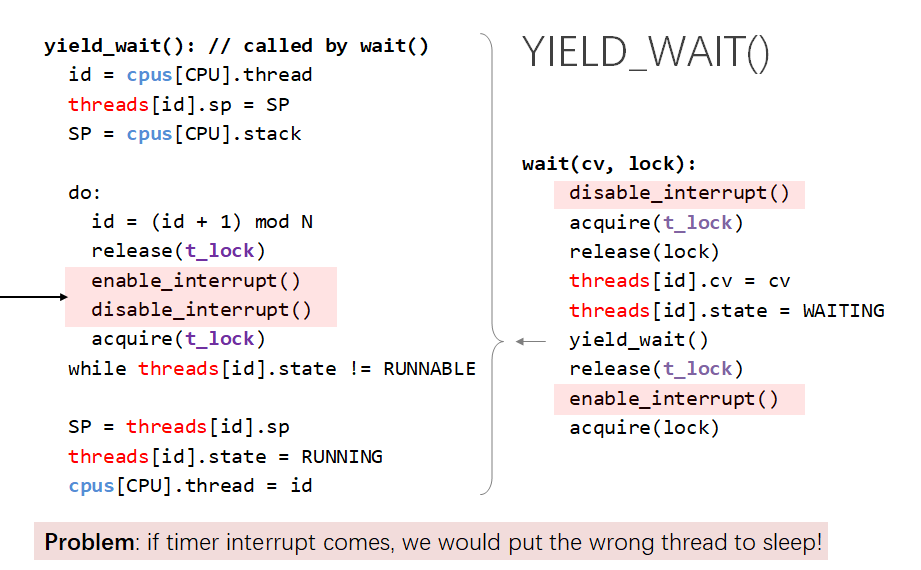
    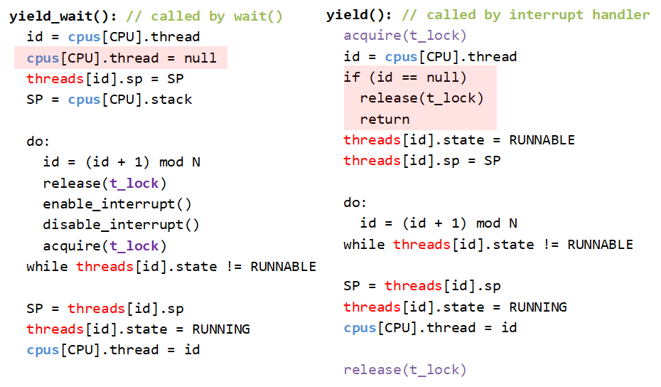

- Final wait(cv, lock) & yield_wait()
    ```
    wait(cv, lock):
        disable_interrupt()
        acquire(t_lock)
        release(lock)
        threads[id].cv = cv
        threads[id].state = WAITING
        yield_wait()
        release(t_lock)
        enable_interrupt()
        acquire(lock)

    yield_wait(): // called by wait()
        id = cpus[CPU].thread
        cpus[CPU].thread = null
        threads[id].sp = SP
        SP = cpus[CPU].stack

        do:
            id = (id + 1) mod N
            release(t_lock)
            enable_interrupt()
            disable_interrupt()
            acquire(t_lock)
        while threads[id].state != RUNNABLE

        SP = threads[id].sp
        threads[id].state = RUNNING
        cpus[CPU].thread = id
    ```

## Summary
- Threads
    - Virtualize a processor so that we can share it among programs
    - yield() allows the kernel to suspend the current thread and resume another
- Condition Variables
    - Provide a more efficient API for threads
    - Threads wait for an event and are notified when it occurs
    - wait() requires a new version of yield(), yield_wait()
- Preemption
    - Forces a thread to be interrupted
        - So that do not have to rely on programmers correctly using yield()
    - Requires a special interrupt and hardware support to disable other interrupts

# Eventcount & Sequencer
- 按先后顺序拿锁

## 4 Primitives

- AWAIT (eventcount, value)
    - 设置当前线程的 event 和 value
    - 当满足 event.count <= value 时，使当前进程休眠
    ```
    procedure AWAIT(eventcount reference event, value)
        ACQUIRE(thread_table_lock)
        id <- GET_THREAD_ID()
        thread_table[id].event <- event
        thread_table[id].value <- value
        if (event.count <= value) then thread_talbe[id].state <- WAITING
        ENTER_PROCESSOR_LAYER(id, CPUID)
        RELEASE(thread_table_lock)
    ```
- ADVANCE (eventcount)
    - 使 event.count 自加
    - 查找 thread_table，若线程满足下述条件，则将状态置为 RUNNABLE
        - 状态为 WAITING
        - 那个线程的 event 与当前传入的 event 相同
        - event.count > value
    ```
    procedure ADVANCE(eventcount reference event)
        ACQUIRE(thread_table_lock)
        event.count <- event.count + 1
        for i from 0 until 7 do
            if thread_table[i].state == WAITING and thread_table[i].event == event and event.count > thread_table[i].value then
                thread_table[i].state <- RUNNABLE
        RELEASE(thread_table_lock)
    ```
- TICKET (sequencer)
    - 发票
        - 发一张位于序列 s 队尾的票
        - 序列 s 的总票数自增
    ```
    procedure TICKET(sequencer reference s)
        ACQUIRE(thread_table_lock)
        t <- s.ticket
        s.ticket <- t + 1
        RELEASE(thread_table_lock)
        return t
    ```
- READ (eventcount or sequencer)
    - 加锁，原子地读取 event.count
    ```
        procedure READ(eventcount reference event)
            ACQUIRE(thread_table_lock)
            e <- event.count
            RELEASE(thread_table_lock)
            return e
    ```
- Question: 这会有 Lost Notification 问题么？
    - Answer： No, since the AWAIT and ADVANCE are synced by the thread_table_lock. 
    - PPT原文答案如上，感觉描述很奇怪。
    - 先 ADVANCE，满足 AWAIT 条件，之后执行 AWAIT 满足条件了就继续执行，不满足则该线程状态就被置为 WAITING 进入 PROCESSOR LAYER 切换到别的线程去执行。
    - 说白了，AWAIT 和 ADVANCE 不存在 while-loop，它的实现依赖于 if-statement

## Single Sender and Single Receiver
```
procedure SEND(buffer reference p, message msg)
    AWAIT(p.out, p.in - N)
    p.message[READ(p.in) modulo N] <- msg
    ADVANCE(p.in)

procedure RECEIVE(buffer reference p)
    AWAIT(p.in, p.out)
    msg <- p.message[READ(p.out) modulo N]
    ADVANCE(p.out)
    return msg
```

## Multiple Senders and Single Receiver
```
procedure SEND(buffer reference p, message msg)
    t <- TICKET(p.sender)
    AWAIT(p.in, t)
    AWAIT(p.out, READ(p.in) - N)
    p.message[READ(p.in) modulo N] <- msg
    ADVANCE(p.in)
```
- 正常运行是建立在 Bounded Buffer 的假设
    - p.in, p.out 不会发生溢出

# OS Structures
- Monolithic kernel, Micro-kernel, Virtual Machine

## Monolithic Kernel
- Linux is Monolithic
    - No enforced modularity
    - A bug in the kernel can affect entire system
- The kernel is trusted for hardware management
    - Memory manager
    - Devices manager, e.g., clock, display, disk
- Modules that manage the hardware are part of the kernel
    - The window manager, network manager , file manager
- Monolithic kernel
    - Most of the operating system runs in kernel mode

    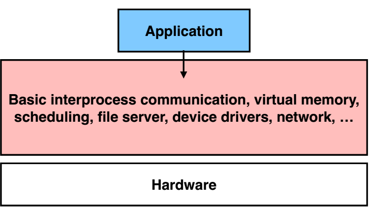
    - No Enforced Modularity within the Kernel

- Pros & Cons
    - Pros
        - Relatively few crossings
        - Shared kernel address space
        - Performance
    - Cons
        - Flexibility
        - Stability
        - Experimentation

## Microkernel
- It is preferred to keep the kernel small
    - Reduce the number of bugs
    - Restrict errors in the module
        - E.g., the file manager module error may overwrite kernel data structures unrelated to the file system
        - Causing unrelated parts of the kernel to fail
- System modules run in user mode 
    - Each module is restricted in its own domain
- Microkernel itself implements a minimal set of abstractions
    - Domains to contain modules  
    - Threads to run programs
    - Virtual communication links

    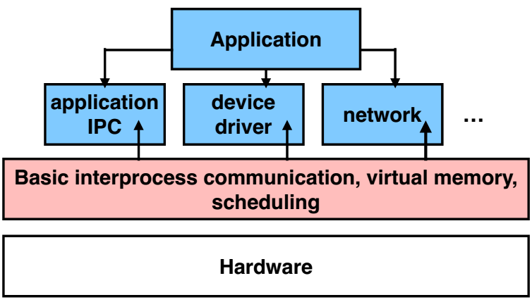

    - Enforce Modularity by Putting Subsystems in User Space
- Pros & Cons
    - Pros
        - Easier to develop services
        - Fault isolation
        - Customization
        - Smaller kernel => easier to optimize
    - Cons
        - Lots of boundary crossings
        - Relatively poor performance

## Microkernel VS. Monolithic Kernel

- Few microkernel OS
    - Mach, L4
- Most widely-used operating systems have a mostly monolithic kernel
    - the GNU/Linux operating system
    - the file and the network service run in kernel mode
    - the X Window system runs in user mode

1. The system is unusable if a critical service fails
    - No matter in user mode or kernel mode
2. Some services are shared among many modules
    - It’s easier to implement these services as part of the kernel program, which is already shared among all modules
3. The performance of some services is critical
    - E.g., the overhead of SEND and RECEIVE supervisor calls may be too large
4. Monolithic systems can enjoy the ease of debugging of microkernel systems 
    - good kernel debugging tools
5. It may be difficult to reorganize existing kernel programs
    - There is little incentive to change a kernel program that already works
    - If the system works and most of the errors have been eradicated
        - the debugging advantage of microkernel begins to evaporate
        - the cost of SEND and RECEIVE supervisor calls begins to dominate

- How to choose
    - a working system and a better designed, but new system
    - don’t switch over to the new system unless it is <b>much better</b> 
- The overhead of switching
    - learning the new design
    - re-engineering the old system to use the new design
    - rediscovering undocumented assumptions
    - discovering unrealized assumptions
- The uncertainty of the gain of switching
    - The claims about the better design are speculative
    - There is little experimental evidence that 
        - microkernel-based systems are more robust than existing monolithic kernels

## Another Fancy Solution

- Problem: 
    - Deal with Linux kernel bugs without redesigning Linux from scratch

- One idea: run different programs on different computers
    - Each computer has its own Linux kernel; if one crashes, others not affected
    - Strong isolation (all interactions are client-server), but often impractical
    - Can't afford so many physical computers: hardware cost, power, space, ..

# Virtual Machine

## Run Multiple Linux on a Single Computer
- Virtualization + Abstractions
    - New constraint: compatibility, because we want to run existing Linux kernel
    - Linux kernel written to run on regular hardware
    - No abstractions, pure virtualization

- Approach is called "virtual machines" (VM): 
    - Each virtual machine is often called a guest
    - The equivalent of a kernel is called a "virtual machine monitor" (VMM)
    - The VMM is often called the host

## Why Virtual Machine
- Consolidation
    - Run several different OS on a single machine
- Isolation
    - Keep the VMs separated as error container
    - Fault tolerant
- Maintenance
    - Easy to deploy, backup, clone, migrate
- Security
    - VM introspection
    - Antivirus out of the OS

## Differences between OS & VMM

- Similarities
    - Multiplex hardware
    - Higher privilege
- Differences
    - Different abstraction
    - VMM schedules VMs, OS schedules processes

    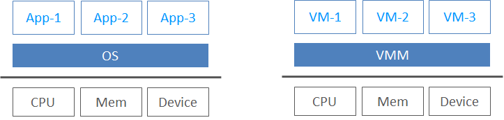

## Virtualization 
- CPU virtualization
    - Enable each guest VM has its own kernel and user modes
    - Keep isolation between guest’s kernel and user modes
- Memory virtualization
    - Enable each guest VM has its own virtual MMU
    - Keep isolation between guest VMs
- I/O virtualization
    - Enable each guest VM has its own virtual devices

# CPU Virtualization

## Process and VM
- Each process thinks it has the entire CPU
    - Does not care other processes
- OS schedules the processes
    - OS splits the CPU time to time-slices
    - Schedule each process preemptively
    - 3 phases: save context, find next, restore context

- Idea: Why not run a VM as a process?

## Run OS as an Application

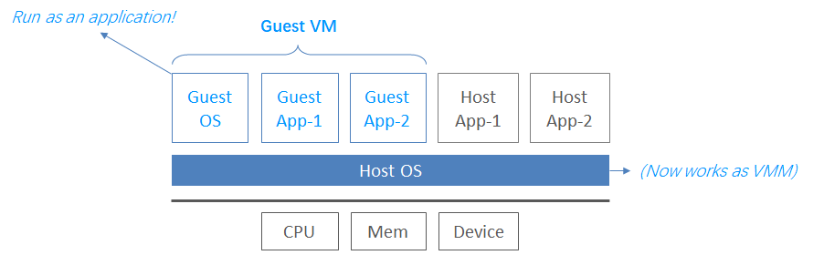

- Stuck at the very first instruction
    - cli : disable interrupt
    - It’s a privilege instruction
    - <b>Cannot run in user mode!</b>
- Similar instructions
    - E.g., change CR3, set IDT, etc.
    - These instructions will change machine states

- Challenges of Privilege Instruction
    - Guest OS executes privilege instructions
    - Guest OS are not allowed to run the privilege instructions

### Trap & Emulate
- Trap: privilege 指令在 user-mode 中无法运行，因此会被 VMM 截获 
- Emulate: 由 VMM 实现这些命令

    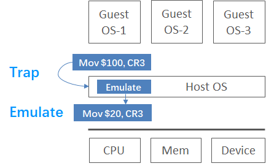

- How does a host OS deliver interrupt to a guest OS?
    - Similar as delivering a signal to an application

- Problem
    1. 并不是所有处理器架构都是严格可虚拟化的
        - x86 ISA 指令集中有 17 条指令在 user-level, system level 都有，但是操作结果不同。
    2. Trap 代价可能会很高昂
    
- Solution
    - Intepretation
        - 使用纯软件模拟 CPU

    - Binary Translator
        - 将这 17 条指令直接翻译成另外的指令

    - Para-Virtualization
        - 修改 OS 代码
            - 对那 17 条命令进行另外的实现
                - hypercall
        - guestOS 知道自己是虚拟机
            - 当调用这 17 条指令时，判断是否为虚拟机，如果是则去调用 hypercall
    - Hardware Supported
        - 直接修改硬件，使得这些指令严格可虚拟化。为虚拟机提供虚拟的级别。

### 1. Instruction Interpretation

代码略

- Positives
    - Easy to implement & minimal complexity
- Negatives
    - Very slow!

### 2. Binary Translator

代码略

- Translate before execution
    - Translation unit is basic block (why?)
    - Each basic block -> code cache
    - Translate the 17 instructions to function calls
        - Implemented by the VMM
    
    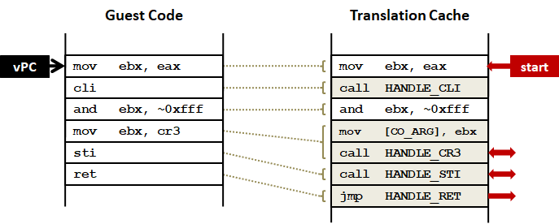

    - call HANDLE_XXX 会污染栈，因此直接把函数写进去，inline

    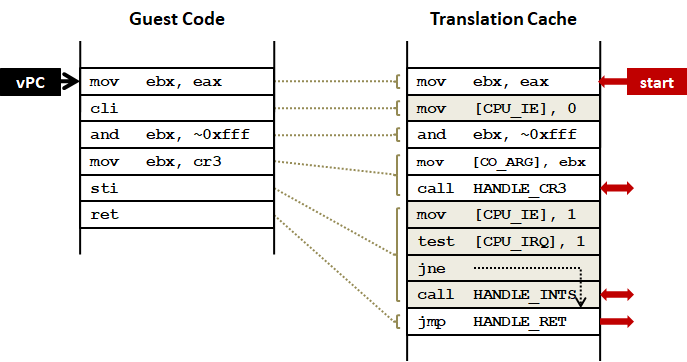

- Issues with Binary Translation
    - PC synchronization on interrupts
        - Now interrupt will only happen at basic block boundary
        - But on real machine, interrupt may happen at any instruction
    - Carefully handle self-modifying code (SMC)
        - Notified on writes to translated guest code

- Hybrid Approach

    

    - Binary translation for the kernel
    - Direct execution (trap & emulate) for the applications

### 3. Para-virtualization

- Modify OS and let it cooperate with the VMM
    - Change sensitive instructions to calls to the VMM
        - Also known as hypercall
    - Hypercall can be seen as trap

### 4. Hardware Supported CPU Virtualization

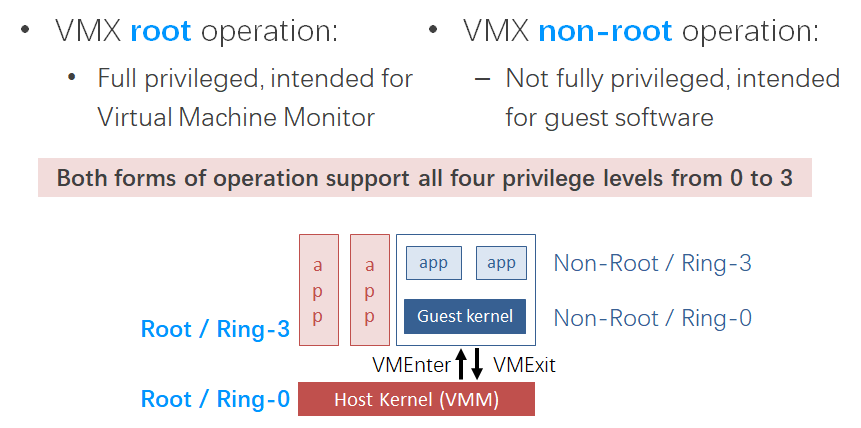

# Memory Virtualization

## Virtualizing the Page Tables
- Terminology: 3 types of address now
    - GVA->GPA->HPA (Guest virtual. Guest physical. Host physical)
    - Guest VM's page table contains GPA
- Setting CR3 to point to guest page table would not work
    - E.g., a processes in VM might access host physical address 0~1GB, which might not belong to that guest VM
    - Solution-1: shadow paging
    - Solution-2: direct paging
    - Solution-3: new hardware

### 1. Shadow Pages

- 每个虚拟机自己拥有一个 Host Page Tables （虚拟机从宿主机拿内存给自己使用）
- 虚拟机中每个应用自己拥有一个 Guest Page Tables （应用从虚拟机拿内存给自己用）
- 因此我们需要一个 Shadow Page Table 将虚拟机内虚拟地址直接翻译为宿主机物理地址。直接从 Shadow Page Table 中读取。

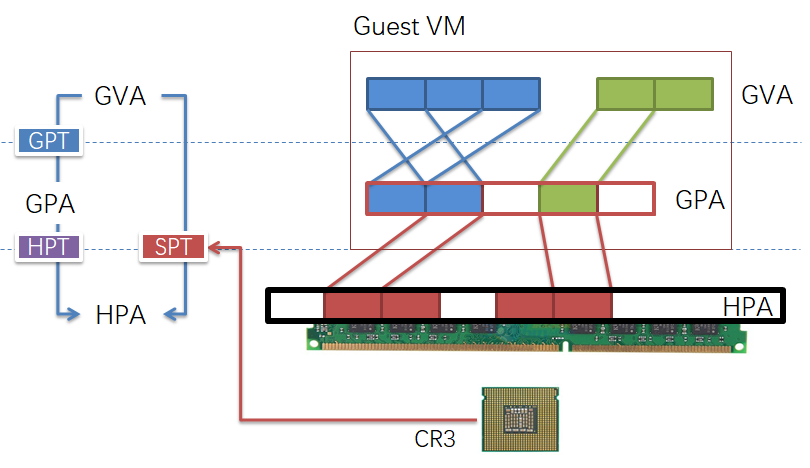

- Two Page Tables Become One
    1. VMM 截断 guest OS，并且设置虚拟的 CR3 （指向 shadow page table）
    2. VMM 遍历所有 guest page table, 建立 shadow page table
    3. In shadow PT, every guest physical address is translated into host physical address
    4. Finally, VMM loads the host physical address of the shadow page table

    ```
    set_cr3 (guest_page_table):
        for GVA in 0 to 220
            if guest_page_table[GVA] & PTE_P:
                GPA = guest_page_table[GVA] >> 12
                HPA = host_page_table[GPA] >> 12
                shadow_page_table[GVA] = (HPA<<12)|PTE_P
            else
                shadow_page_table = 0
        CR3 = PHYSICAL_ADDR(shadow_page_table)
    ```

- Question
    - Assume that:
        - There are 10 VMs running on a machine
        - Each VM contains 10 applications
    - Q: how many shadow page tables in total?
        - Shadow page tables are per application
        - Guest page tables are per application
        - Host page tables are per VM

- Problem: 
    1. What if Guest OS Modifies its Own Page Table?
        - No effect
            - Guest Page Table 被修改，而 Shadow Page Table 没有被修改
            - 现在 CR3 指向 Shadow Page Table，读取时是读 Shadow Page Table，因此读不到 Guest Page Table 的变化
        - Solution:
            - VMM need to intercept when guest OS modifies page table, and update the shadow page table accordingly
            1. Mark the guest table pages as read-only (in the shadow page table)
            2. If guest OS tries to modify its page tables, it triggers page fault
            3. VMM handles the page fault by updating shadow page table
    2. What if a Guest App Access its Kernel Memory?
        - 
        - Remember that now the kernel is running in user mode
            - It means any application may also access guest kernel’s memory
            - <b>How do we selectively allow / deny access to kernel-only pages? </b>
        - Solution:
            - Two shadow page tables, one for user, one for kernel
            - When guest OS switches to user mode, VMM will switch the shadow page table as well, vice versa
            - Recall trap & emulate

        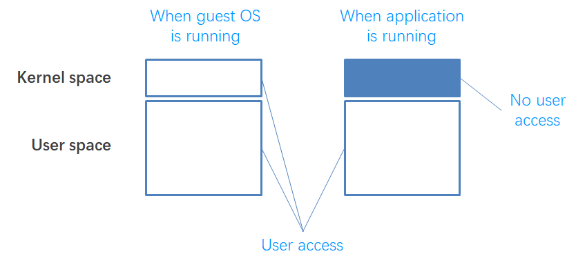

### 2. Direct Paging (Para-virtualization)

- Modify the guest OS
    - No GPA is needed, just GVA and HPA
    - Guest OS directly manages its HPA space
    - Use hypercall to let the VMM update the page table
    - The hardware CR3 will point to guest page table
- VMM will check all the page table operations
    - The guest page tables are read-only to the guest

- Pros & Cons
    - Positive
        - Easy to implement and more clear architecture
        - Better performance: guest can batch to reduce trap
    - Negatives
        - Not transparent to the guest OS
        - The guest now knows much info, e.g., HPA
            - May use such info to trigger rowhammer attacks

### 3. Hardware Supported Memory Virtualization

- Hardware implementation
    - Intel’s EPT (Extended Page Table)
    - AMD’s NPT (Nested Page Table)
- Another table
    - EPT for translation from GPA to HPA
        - 两次查找，性能较差，但是十分简单
    - EPT is controlled by the hypervisor
    - EPT is per-VM
- 之前提到的权限问题直接由下图右边的线解决
- 因此不需要像 SPT 那样维护两个 SPT
    

# System Performance
- Design for performance

## Improving Performance
- Get faster hardware

- Fix application: better algorithm, fewer features

- General system optimization techniques
    1. Batching
    2. Caching
    3. Concurrency
    4. Scheduling

## Performance Metrics

1. Capacity - Size or amount of service
2. Utilization – Fraction of capacity used by a workload
3. Latency - the time it takes from start to finish
    - For a multi-step process (Steps A + B)
        - LatencyA+B ≥ LatencyA + LatencyB
4. Throughput - rate at which work is done
    - Pipeline of modules
        - ThoughputA+B ≤ minimum(ThroughputA, ThroughputB)
        - Bottleneck

## Relationship between Latency & Throughput
- Serial
    - Throughput = 1 / Latency
- Parallel
    - No direct relationship

## Improving Bottlenecks
- Latency
    - Frequently fundamental limits 由基础设施导致延迟
        - Speed of CPU
        - Speed of communication link (e.g., light)
- Throughput
    - Resource limit 资源越多，吞吐量越大
        - Example: Buy a fatter pipe but it costs more
        - Famous saying: You can buy throughput but you can't bribe god

### Fast Path for Latency Optimizations

- 让问题在大多数情况下更快
    - e.g. Cache Hit VS. Cache Miss

    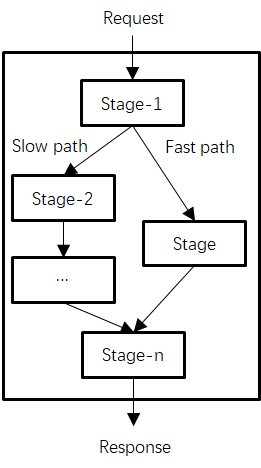

- 这种优化依赖于 workload 的分布情况，走 Fast Path 的频率有多大
- 不过大部分 workload 并不是均匀分布的，所以这种方法是有效的

- Example: 传统的 Fast Path 优化：缓存
    - Use knowledge of workload: memory abstractions
        - Keep common requests in a fast local memory
        - Check the local memory every access

    - CPU cache – Cache 1ns, Memory 100ns, 90% hit rate
        - AverageLatency = 0.9 x 1ns + 0.1 x 100ns = 10.9 ns (100ns -> 10.9ns)

    - Used everywhere there are memory abstractions
        - Processors, file systems, TLBs, browsers, DNS, etc.

### Reducing Latency using Concurrency

- Example: Google search engine
    - Splits the index of the Web up in n pieces, each piece on a machine
    - Frontend sends copies of requests and combines the response

- If subtasks are independent to each other
    - Can use n threads to get a speedup of n
    - Hard to get the ideal speedup
        - 10 months a man -> 1 month 10 men?

### Using Concurrency to Improve Throughput


### Hide Latency by Overlapping
- Similar to concurrency but different
- Fetch (5 time units) and process (5 units) 2 blocks (20 units)
    - Fetch B1; Process B1; Fetch B2; Process B2; 
- Fetch 2 blocks asynchronously (15 units)
    - Send request for B1,B2; 
    - Receive B1; Process B1; Receive B2; Process B2
- Processors prefetching memory requests
    - File systems prefetching files
    - Browser prefetching pages

    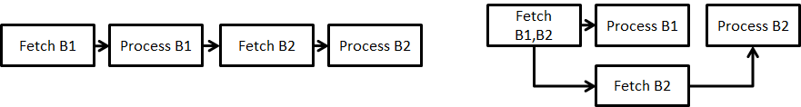

### Queuing and Overload

- Offered Load: the rate of arrival of requests for service
- Overload: whenever the offered load is greater than the capacity of a service for some duration
    - E.g., 7 threads on 3 processors, must wait in queue (RUNNABLE)
- The queuing theory 排队论
    - Unit is the average service time
    - The waiting time in a queue: 1/(1-ρ), ρ is the utilization
    - Once the utilization approaches 1, the delay will grow without bound
- 如何优化？
    - Make the capacity match the offered load of requests
        - Example:
            - CPU: one instruction per ns; Memory: respond takes 10 ns
            - CPU must make a memory request 10 ns in advance
            - Memory must serve 10 requests concurrently
                - If half instructions are memory request, then only 5 concurrently
                - But cannot predicate the pattern of memory access
    - 如果 Overload 短时出现，通过队列的方式即可将 Overload 分摊到附近的时间片段
    - 如果 Overload 长时间出现
        - 应当增加容量
        - 减少或限制 Offered Load
            - 使用 Bounded Buffer 控制 offered load
                - <b>Self managing</b>, if the a source needs the results of the output
                - If source makes no request at all, then offered load decreases
                - If source holds the request and resubmits it later, offered load doesn't decrease
                - Put a quota on the source (e.g.,  max threads per application)
            - Reducing the offered load when a stage becomes overloaded: e.g., swapping

# Fighting Bottlenecks

## Why Performance Bottlenect?
1. Physical limitation
    - Speed of light
    - The capacity of memory
2. Sharing
    - Several users share a device
    - Several clients share a server

## How to Improve Performance
1. Measure the system to find the bottleneck
2. Relax the bottleneck
    - Batch requests
    - Cache data
    - Exploit concurrency
    - Exploit parallelism (scheduling)

### Batching

- Frequently it is possible to group requests for more efficiency
    - Amortize overheads of processing
    - Schedule requests for better performance

### Dallying(? Caching)
- Procrastination sometimes helps
Temp files – deleted before written to disk
Examples: 
Caches – Write back policy: Write absorption
Database transactions – group commit
Might hold your ATM request until others arrive to do batching

### Speculation(Prediction)

- Guessing at an operation and performing it ahead a time
    - Need to be able to undo changes if wrong
- Examples:
    - Processors guess at branches, memory access
    - File systems guess at next file block needed (prefetching)
    - Easier if space of possibilities is small
    - Branch prediction versus value prediction

### Problem
- These approaches mentioned above will introduce complexity
    - They introduce concurrency 
    - Coordination(协调) is difficult to get right 
    - E.g., the Meltdown and Spectre attacks on Intel's CPU
        - 通过 cache 使得系统级数据泄露进行攻击。具体不做展开。

## Case: I/O Bottleneck

### Introduction

- Average seek latency: about 8 milliseconds
    - Time to move the head over 1/3 of the disk

- The average rotational latency: 4.17 milliseconds
    - The disks spin at 7200 rotations/minute
    - One rotation every 8.33 milliseconds (60/7200)
    - On average, the disk has to wait a half rotation for the desired block to be under the disk head

- A Typical Modern 400 Gigabyte Disk
    - Has 16,383 cylinders, or about 24 megabytes per cylinder
    - Would have 8 two-sided platters and thus 16 read/write heads
    - Would be 24/16 = 1.5 megabytes per track
    - When rotating at 7200 revolutions per minute (120 per second)
    - The bits will go by a head at 180 megabytes per second (1.5 x 120)

### Bottleneck

- The IDE bus: 66 MB/S is common
- The Serial ATA-3 bus: 6 Gbps 

- With IDE bus: The electronics would be the bottleneck
    - at 66 MB/S
- With SATA-3 bus: The mechanics would be the bottleneck
    - at 180 MB/S

### Latency of 4-KB Data Accessing (Using IDE)
- The latency of reading a 4 kilobyte block chosen at random:
- avg seek time + avg rotation latency + transmission of 4 kilobytes 
    - = 8 + 4.17 + (4 / (66 × 1024)) × 1000 milliseconds
    - = 8 + 4.17 + 0.06 milliseconds
    - = 12.23 milliseconds

- The throughput for reading randomly-chosen blocks one by one is:
    - = 1000/12.23 × 4 kilobytes per second
    - = 327 kilobytes/second

### Optimization
#### Round-1: No Optimization
- reading 4 kilobyte + 1 millisecond of computation + writing 4 kilobyte
= 12.23 + 1+ 12.23 milliseconds
= 25.46 milliseconds

    ```
    1 	in ← OPEN (“in”, READ) 		// open “in” for reading
    2 	out ← OPEN (“out”, WRITE) 	         // open “out” for reading
    3
    4	while not ENDOFFILE (in) do
    5 		block ← READ (in, 4096)  	// read 4 kilobyte block from in
    6 		block ← COMPUTE (block)  	// compute for 1 millisecond
    7 		WRITE (out, block, 4096) 	// write 4 kilobyte block to out
    8 	CLOSE (in)
    9 	CLOSE (out)
    ```

#### Round-2
- Modify the file system 
    - to layout the blocks of a file contiguously
    - to prefetch an entire track of data on each read

- Average seek time + 1 rotational delay
    - = 8 + 8.33 milliseconds = 16.33 milliseconds

- 每 384 次循环读一次，而不是 Round 1 中的读 384 次
- File system issues 1 read request per 384 (1.5 MB per track / 4 KB) loop iterations
- The average time for 384 iterations is:
- reading 1536 kilobyte + 384× (1 millisecond of computation + writing 4 kilobyte)
    - = 16.33 + 384 × (1 + 12.23) millisecond
    - = 16.33 + 5080.32 milliseconds
    - = 5096.65 milliseconds
- Thus, the average time for a loop iteration is 5096.65/384 = 13.27 milliseconds

#### Round-3

- 每 384 次循环写一次，而不是之前的写 384 次
- Improve by dallying & batching write requests
- Write to buffer in RAM and flush when buffer is full
- Latency = (16.33 + 384 + 16.33)/384 milliseconds
= 1.09 milliseconds

#### Round-4
- 类似于 Pipeline，读取第一次之后，每次读取跟计算可以 Overlap
- Prefetch the next track before the 385th READ
- Overlap computation and I/O completely
- The average time around the loop is 1 millisecond
- The bottleneck now is the CPU

# Cache Policies

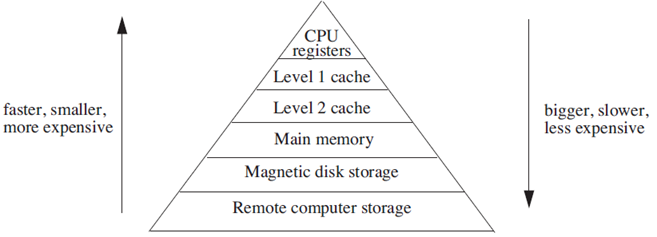

- Locality of reference
    - Temporal locality and spatial locality
    - <b>Thrashing</b>: repeated movement of data back and forth between two levels


## Multilevel Memory Management Policies
- Each level of multi-level memory system can be characterized by 4 items
    - The <b>string of references</b> directed to that level
    - The <b>bring-in policy</b> for that level
    - The <b>removal policy</b> for that level
    - The <b>capacity</b> of the level

### Page-removal Policies

- First-in, first-out (FIFO) page-removal policy
    - Remove the page that has been in the primary device the longest
    - Problem: Belady's anomaly
        - Performance drops with a larger primary device capacity!
- Optimal (OPT) page-removal policy (ideal but impossible)
    - Choose for removal the page that will not be needed for the longest time
- Least-recently-used (LRU) page-removal policy
    - The page in the primary device that has not been used for the longest time
    - Problem:
        - 考虑特殊情况：容量 3，不断循环访问 0，1，2，3，4，此时 Most-Recently-Used 比 LRU 更好。（但是过于特殊）
- Stack Algorithms
    - LRU 的一种实现
    - 容量为 3 时的情况时容量为 4 的情况时的子集，因此不会导致 Belady's anomaly
    - Subset property
        - For the optimal policy, at all times, the pages it keeps in the 3-page memory is a subset of that it keeps in the 4-page memory
- No Belady's anomaly if subset property holds
    - At all times and for every possible capacity of primary device, it creates a total ordering for pages at a given time

### 如何分析选择不同的策略
- 主要根据 workload 来选择 policy ，然后调整 size 等参数
- Ways of deciding the following two things:
    - How large the primary memory device should be?
    Which page removal policy to use?
- Collecting traces of the reference strings of typical programs
- Simulate the multilevel memory manager with:
    1. Different configurations
    2. Size of primary device
    3. Page removal policy
    4. Traces of memory access

### Efficiency of Page-Removal Policies
- 实际使用时还要考虑算法实现的效率。比如 LRU 使用 Clock Algorithm 近似
- Clock page-removal algorithm
    - Base on a hardware setting bit
	    - Reference bit
    - Move clockwise
	    - If T, set F
	    - Choose as the victim otherwise
- Random removal policy
    - For TLB
- Directed mapping

# Scheduling

## Challenge
- Lack of information
    - Packet scheduling and streaming media 
- Lack of mechanism to enforce policies 
    - Give high priority to CPU, but can't get to disk or network
- Getting mechanism right 
    - Many schedulers break rather than gracefully degrade under load

- Exapmle: Livelock under Overload
    - Web server spends most time handling interrupt and dropping requests

## The Ideal Scheduler
1. Mini latency: How long a service takes? E.g., Move mouse, cursor moves 
2. Max throughput: Max jobs / time. E.g., Web server pages/second 
3. Low overheads: Scheduler doesn't use any resources 
4. Fairness: everyone gets to make progress, no one starves 
5. Scales linearly up to capacity: Graceful handling of overload 

- System-level goal may conflict with the needs of individual threads
    - System: minimal preemption(抢占)
    - Apps: finish as soon as possible

## Measuring the Request's Response
- Turn-around time: The length of time from when a request arrives at a service until it completes
- Response time: The length of time from when a request arrives at a service until it starts producing output
- Waiting time: The length of time from when a request arrives at a service until the service starts processing the request

## First Come First Server
- Fairness paramount (most important point)
- Good for printer 打印机 scheduler

- For the processor
    - One thread that periodically waits for I/O but mostly computes 
    - Several threads that perform mostly I/O operations

- For the scheduler
    - It runs the I/O-bound threads first
    - Then runs the computation intensive thread 
    - All quickly finished computations and waiting for I/O

## Convoy Effect (短的等在长的后面)

- When I/O devices are idle
    - The I/O-bound threads will quickly finish computations and start I/O
    - The processor-bound thread will run for a long time
    - I/O-bound operations will finish I/O and queuing for computation
    - All the I/O devices will become idle!
- When processor is idle
    - The processor-bound thread finishes computation and starts I/O
    - The I/O-bound threads will quickly finish computations and start I/O
    - Processor will become idle!

## Shortest-Job-First
- Require a prediction of the running time of a job before running
- Starvation: several short jobs makes a long job starve

## Round-Robin
- Select the first job from queue as in the first-come first-serve policy
- Stop the job and push it to the queue after some period of time, and select a new job

## Priority Scheduling Policy
- Priority Scheduling Policy
    - Assign each job a priority number (static vs. dynamic)
    - Select the job with the highest priority number
    - Must have some rule to break ties
- Modern CPU schedulers have 
    - Priorities: Run job with the highest priority 
    - Round Robin: Alternate among jobs of same priority, preempt a job if it holds CPU too long 

## CPU Scheduling Policy 
- Assign priorities to jobs
    - Give high priorities to I/O-bound jobs 
    - Give low priorities to CPU-bound jobs 
    - Handles I/O-bound and CPU-bound jobs nicely 

- Challenge: distinguish I/O-bound and CPU-bound 
- Look at past behavior to predict the future 
    - Linux: Priority of job is function of amount of CPU it has used  
- Counterintuitive: 
    - More CPU a job uses/needs, the lower its priority 
    - The less CPU it uses, the higher its priority 
    - Avoids starvation problems: Not running gives task a higher priority

## The Priority Inversion Problem
- Problem: what if a high priority thread waits for a low priority one which holding a lock?
- Solution: priority inheritance

## Real-Time Scheduling

- Missed deadline = incorrect behavior 
- Soft real time: Display video frame every 30th of sec 
- Hard real time: "apply-breaks" process in your car 
- Scheduling more than one thing: memory, network bandwidth, CPU all at once 

## Earliest Deadline First (EDF)

- Keep the queue of jobs sorted by deadline
- Run the first of the queue
- Minimize the total lateness of all the jobs

- <b>How to know deadline?</b>
    - Specified by tasks themselves
    - In the form of (C, P), C for second, P for period
        - P 是时间片段， C 是 P 时间内需要占用的时间
    - The scheduler rejects new task if sum(Ci/Pi) > 1

## Disk Scheduling: Goals
- Minimize time spent waiting on disk mechanisms 
    - Moving the disk arm 
    - Waiting for sector to rotate under disk heads
- Fairness 
    - Should not make requests wait too long 

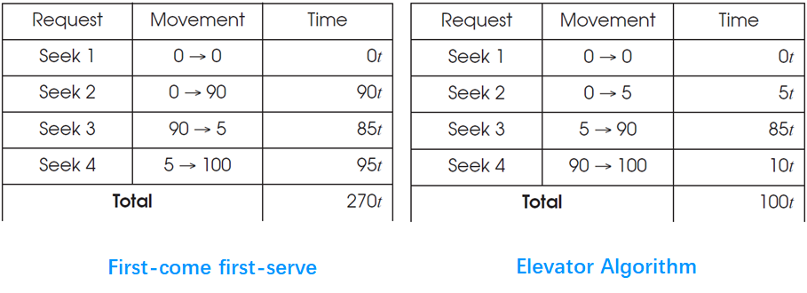
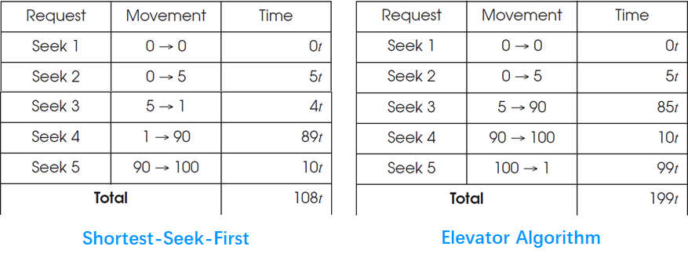